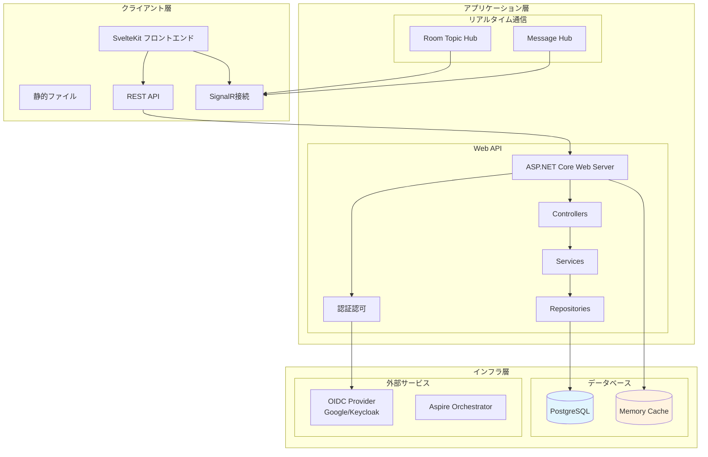
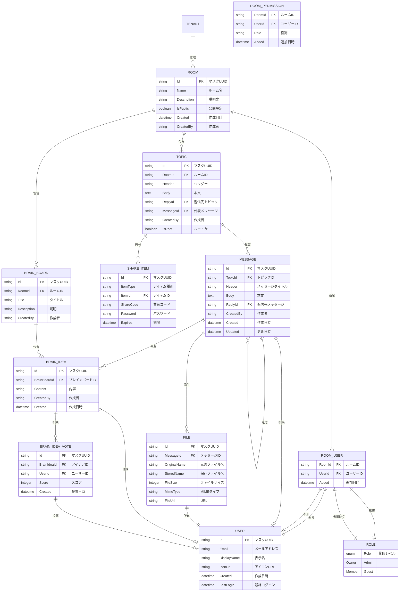
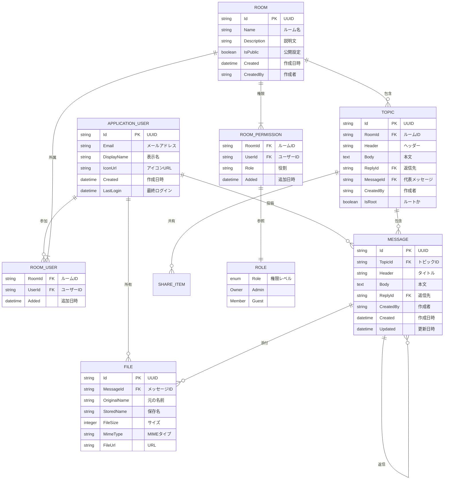

# システム概要

## TL;DR

TreeTopicは、.NET 10とSvelteKitで構築されたマルチテナント対応のオープンソース議論プラットフォームです。PostgreSQLをデータストアに使用し、SignalRを介したリアルタイムコミュニケーションをサポートしています。GitHubリポジトリ: [https://github.com/actbit/TreeTopic](https://github.com/actbit/TreeTopic)

## システムアーキテクチャ

## ドキュメントへの導線

このドキュメントに関連する主要なファイル：

| 機能 | ファイルパス | 説明 |
|------|-------------|------|
| アプリケーション設定 | `TreeTopic/Program.cs` | メインアプリケーション設定 |
| データモデル | `TreeTopic/Models/` | エンティティ定義 |
| アーキテクチャ図 | `docs/10_overview.md` | システム全体像 |

## 関連ドキュメント

- [開発環境構築](20_getting-started.md) - ローカルでのセットアップ方法
- [リポジトリ構造](30_repo-map.md) - コードの全体像
- [コア概念](40_core-concepts.md) - ドメイン知識
- [データフロー](50_data-flow.md) - 処理フロー詳細

## システムアーキテクチャ



## 主要技術スタック

### バックエンド
- **フレームワーク**: ASP.NET Core 9.0
- **言語**: C# (.NET 10.0)
- **データベース**: PostgreSQL + Entity Framework Core
- **マルチテナント**: Finbuckle.MultiTenant
- **認証**: OpenID Connect (Cookie)
- **リアルタイム通信**: SignalR
- **APIドキュメント**: OpenAPI/Swagger
- **暗号化**: AES, UUIDマスキング

### フロントエンド
- **フレームワーク**: SvelteKit 2.49.1
- **言語**: TypeScript 5.9.3
- **ビルドツール**: Vite 7.2.6
- **キャンバス操作**: Fabric.js
- **PDF処理**: PDF.js
- **リアルタイム通信**: SignalRクライアント

### 開発ツール
- **マイクロサービス**: Aspire
- **テスト**: xUnit (統合テストは実装中)
- **監視**: OpenTelemetry
- **コンテナ化**: Docker

## 主要機能

### 1. マルチテナント対応
- テナント単位のデータ分離
- カスタムOIDCプロバイダー連携
- テナント別UIテーマ

### 2. 議論機能
- 階層的なトピック構造
- メッセージの返信・引用
- 子トピック作成とメッセージ移動
- ファイル添付機能

### 3. リアルタイム機能
- メッセージ即時配信
- ルーム状態のリアルタイム更新
- オンラインユーザー表示
- 自動更新機能

### 4. 権限管理
- ルーム単位のアクセス制御
- ユーザーロールとパーミッション
- アイテム単位の共有設定

## データモデル



### 主要エンティティ関係

### 規模
- **ユーザー**: 1テナントあたり最大10,000ユーザー
- **ファイルアップロード**: 最大30MB
- **メッセージ**: 1メッセージあたり最大500文字
- **ファイル保存**: `uploads/{tenantId}/{userId}/` ディレクトリ

## パフォーマンス特性

### レスポンスタイム
- APIレスポンス: 平均 < 200ms
- データベースクエリ: < 100ms
- リアルタイム通信: < 50ms

### スケーラビリティ
- **水平スケール**: Webサーバーのインスタンス追加
- **データベース**: 読み取り複製対応
- **キャッシュ**: 分散キャッシュの準備中

## セキュリティ対策

### 認証・認可
- OIDCによる認証
- JWTアクセストークン
- Cookieセッション管理
- CSRF保護

### データ保護
- セキュアなデータベース接続
- テナントデータの完全分離
- UUIDマスキングによる情報漏洩防止
- 暗号化キーの定期的なローテーション

### ネットワークセキュリティ
- HTTPS必須
- CORS制限
- リクエストサイズ制限
- 入力値のサニタイズ

## インフラ要件

### ハードウェア要件
- **Webサーバー**: 2 vCPU, 4GB RAM
- **データベース**: 4 vCPU, 8GB RAM, 100GBストレージ
- **クライアント**: 現代のWebブラウザ

### ソフトウェア要件
- **OS**: Windows / Linux / macOS
- **.NET SDK**: 10.0
- **Node.js**: 20.x
- **PostgreSQL**: 15+
- **Docker** (オプション)

### ネットワーク要件
- **ポート**: 80 (HTTP), 443 (HTTPS)
- **インターフェース**: 10Mbps以上

## 開発環境

### ローカル開発
```bash
# .NETプロジェクトのビルド
dotnet build

# SvelteKit開発サーバー起動
cd TreeTopic.Client
npm run dev

# アプリケーション起動
dotnet run
```

### 開発ツール統合
- **IDE**: Visual Studio 2022 / VS Code
- **開発サーバー**: Kestrel
- **ホットリロード**: 両方の環境でサポート
- **デバッグ**: IntelliTrace / .NETデバッガー

## データモデル



### 主要エンティティ関係

```mermaid
graph TB
    User --< RoomUser >-- Room
    Room
    Room
    Room
    Room --> Topic --< Message
    Message --> File
    Message
    Room
    ShareItem
    Role --< RoomPermission >-- Room

    subgraph "エンティティ"
        User["User\n(ユーザー)"]
        RoomUser["RoomUser\n(ルームユーザー)"]
        Room["Room\n(ルーム)"]
        Topic["Topic\n(トピック)"]
        Message["Message\n(メッセージ)"]
        File["File\n(ファイル)"]
        ShareItem["ShareItem\n(共有アイテム)"]
        Role["Role\n(役割)"]
        RoomPermission["RoomPermission\n(ルーム権限)"]
    end

    Room
    Room --> Topic
    Topic --< Message
    Message --> File
    Room
    Room --> ShareItem
    Role --< RoomPermission >-- Room
```

    subgraph "関係の説明"
        User -- RoomUser -->|1:N| Room
        Room --> Topic -->|1:N| Message -->|1:N| File
        Room --> ShareItem
        Role -- RoomPermission -->|1:1| Room
    end

    style User fill:#e8f5e9
    style Room fill:#e3f2fd
    style Topic fill:#f3e5f5
    style Message fill:#fce4ec
    style Role fill:#e0f2f1
```

## アーキテクチャパターン

### Clean Architecture
- **依存関係の逆転**: 依存関係を外部に向ける
- **インターフェース分離**: 各層の明確な境界
- **単一責任**: 各クラスの役割の明確化

### CQRS (Command Query Responsibility Segregation)
- **Command**: データ変更操作
- **Query**: データ参照操作
- **Result<T>**: 統一された戻り値型

### Repositoryパターン
- **データアクセス抽象化**: 具象データベースから独立
- **単一インターフェース**: テスト容易性の向上
- **汎用CRUD操作**: 標準的なデータ操作の標準化

## 将来的な拡張計画

### 機能拡張
- メール通知機能
- 外部サービス連携 (Slack, Discord)
- アーカイブとバックアップ
- セルフホスティングガイド

### パフォーマンス改善
- Redis分散キャッシュ
- スケーリングアーキテクチャ
- CDN対応
- データベースチューニング

### DevOps
- CI/CDパイプラインの強化
- Kubernetes対応
- 監視ダッシュボード
 ロギングシステムの統合

---

**コードへの導線**
- **アーキテクチャ実装**: `TreeTopic/Program.cs`
- **マルチテナント設定**: `TreeTopic/Program.cs` (行73-85)
- **データモデル**: `TreeTopic/Models/`
- **認証設定**: `TreeTopic/Authentication/`

**参照 (根拠)**
- `TreeTopic/TreeTopic.csproj` - プロジェクト定義
- `TreeTopic/Program.cs` - アプリケーション設定
- `TreeTopic/appsettings.json` - 基本設定
- `TreeTopic.Client/package.json` - フロントエンド設定
- `TreeTopic.AppHost/` - Aspireホスト設定
- `TreeTopic/Data/ApplicationDbContext.cs` - データベースコンテキスト
- `TreeTopic/Models/` - データモデル定義