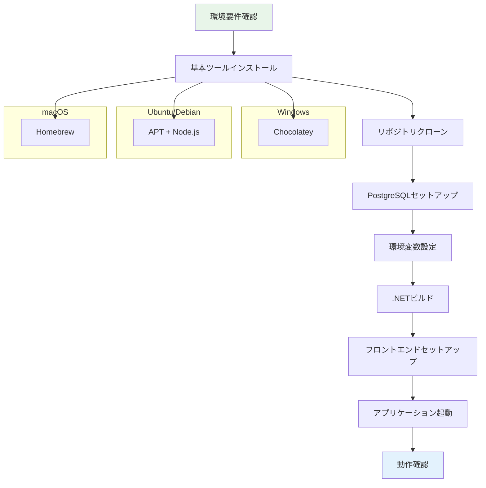

# 開発環境構築

## TL;DR

TreeTopicの開発環境を構築するには、.NET 10とNode.js 20.xが必要です。PostgreSQLとAspireを使ったマルチテナント環境での開発が可能です。

## 必要要件

### システム要件
| 項目 | 必須 | 推奨 | 備考 |
|------|------|------|------|
| OS | Windows 10/11, Ubuntu 20.04+, macOS | 最新版 | Docker Desktopも利用可能 |
| .NET SDK | 10.0 | 最新版 | Visual Studio 2022でも可 |
| Node.js | 20.x | LTS版 | npmバンドル付き |
| PostgreSQL | 15+ | 16+ | Dockerで簡単に起動可能 |
| IDE | VS Code / Visual Studio | 最新版 | 必須ではないが推奨 |

### ツール要件
- **git**: バージョン管理
- **Docker Desktop**: コンテナ開発 (推奨)
- **Visual Studio 2022**: Windows開発環境 (推奨)
- **VS Code**: 軽量開発環境

## インストール手順

### セットアップフロー



### 1. 基本ツールのインストール

#### Windows (Chocolatey)
```powershell
# PowerShellを管理者権限で実行
Set-ExecutionPolicy Bypass -Scope Process -Force; [System.Net.ServicePointManager]::SecurityProtocol = [System.Net.ServicePointManager]::SecurityProtocol -bor 3072; iex ((New-Object System.Net.WebClient).DownloadString('https://community.chocolatey.org/install.ps1'))

# 必要なツールをインストール
choco install -y git nodejs postgresql docker-desktop visualstudio2022community
```

#### Ubuntu / Debian
```bash
# 基本ツールのインストール
sudo apt update
sudo apt install -y git curl wget

# Node.js 20のインストール
curl -fsSL https://deb.nodesource.com/setup_20.x | sudo -E bash -
sudo apt install -y nodejs

# .NET 10のインストール
wget https://packages.microsoft.com/config/ubuntu/22.04/packages-microsoft-prod.deb -O packages-microsoft-prod.deb
sudo dpkg -i packages-microsoft-prod.deb
sudo apt-get update
sudo apt-get install -y dotnet-sdk-10.0

# PostgreSQLのインストール
sudo apt install -y postgresql postgresql-contrib
```

#### macOS (Homebrew)
```bash
# Homebrewのインストール
/bin/bash -c "$(curl -fsSL https://raw.githubusercontent.com/Homebrew/install/HEAD/install.sh)"

# 必要なツールをインストール
brew install git nodejs postgresql dotnet

# Docker Desktop for Mac
# https://www.docker.com/products/docker-desktop/ からダウンロード
```

### 2. リポジトリのクローン
```bash
# リポジトリのクローン
git clone https://github.com/actbit/TreeTopic.git
cd TreeTopic

# ブランチの確認
git branch -a
git checkout feature/message-bug  # 現在のブランチ
```

### 3. PostgreSQLのセットアップ

#### ローカルインストールの場合
```sql
-- PostgreSQLにログイン
sudo -u postgres psql

-- データベースとユーザー作成
CREATE DATABASE treetopic;
CREATE USER treetopic_user WITH PASSWORD 'your_password';
GRANT ALL PRIVILEGES ON DATABASE treetopic TO treetopic_user;
ALTER USER treetopic_user CREATEDB;
\q
```

#### Dockerを使う場合
```bash
# Docker ComposeでPostgreSQLを起動
docker run --name treetopic-postgres \
  -e POSTGRES_DB=treetopic \
  -e POSTGRES_USER=treetopic_user \
  -e POSTGRES_PASSWORD=your_password \
  -p 5432:5432 \
  -d postgres:16

# データコンテナの確認
docker ps
```

### 4. アプリケーションのビルド

#### .NETプロジェクトの準備
```bash
# ルートディレクトリに移動
cd C:\Users\Binary_number\source\repos\TreeTopic

# サブモジュールを取得
git submodule update --init --recursive

# .NETプロジェクトのビルド
dotnet restore
dotnet build

# 依存関係のチェック
dotnet --version
node --version
npm --version
```

#### 環境変数の設定
開発用設定ファイルを作成します：
```bash
# 開発環境設定ファイル
cp TreeTopic/appsettings.Development.json TreeTopic/appsettings.Development.json.backup
```

`TreeTopic/appsettings.Development.json` を編集：
```json
{
  "ConnectionStrings": {
    "DefaultConnection": "Host=localhost;Port=5432;Database=treetopic;Username=treetopic_user;Password=your_password"
  },
  "Logging": {
    "LogLevel": {
      "Default": "Information",
      "Microsoft.AspNetCore": "Warning"
    }
  },
  "AllowedHosts": "*",
  "Encryption": {
    "Key": "your-32-byte-encryption-key-here-please"
  }
}
```

### 5. フロントエンドのセットアップ
```bash
# クライアントプロジェクトディレクトリに移動
cd TreeTopic/TreeTopic.Client

# 依存関係のインストール
npm install

# TypeScript定義の生成
npm run openapi:generate

# 開発サーバーの起動
npm run dev
```

## 起動方法

### 開発サーバーの起動

#### 方法1: 直接実行
```bash
# ルートディレクトリで
dotnet run --project TreeTopic

# 別のターミナルでフロントエンド起動
cd TreeTopic/TreeTopic.Client
npm run dev
```

#### 方法2: Visual Studio 2022で起動
1. `TreeTopic.sln` をVisual Studioで開く
2. `TreeTopic` プロジェクトをスタートアッププロジェクトに設定
3. `Ctrl + F5` でデバッグなしで実行

#### 方法3: Aspireで起動
```bash
# Aspireホストプロジェクトで実行
cd TreeTopic.AppHost
dotnet run

# またはIDEから TreeTopic.AppHost をスタートアッププロジェクトに設定
```

### 起動後の確認
```
# Webアプリケーション
HTTP:  http://localhost:5265
HTTPS: https://localhost:7046

# OpenAPIドキュメント
http://localhost:5265/swagger

# フロントエンド (別ターミナル)
http://localhost:5173

# Aspire Dashboard (Aspire使用時)
http://localhost:18888
```

## 設定ファイル

### 主要設定ファイル
| ファイル | 役割 | 場所 |
|---------|------|------|
| `appsettings.json` | 本番環境設定 | `TreeTopic/` |
| `appsettings.Development.json` | 開発環境設定 | `TreeTopic/` |
| `appsettings.Production.json` | 本番環境追加設定 | `TreeTopic/` |
| `launchSettings.json` | デバッグ設定 | `TreeTopic/Properties/` |
| `vite.config.ts` | フロントエンドビルド設定 | `TreeTopic/TreeTopic.Client/` |

### 重要な設定項目
```json
{
  "ConnectionStrings": {
    "DefaultConnection": "PostgreSQL接続文字列"
  },
  "Encryption": {
    "Key": "32バイトの暗号化キー"
  },
  "Authentication": {
    "Google": {
      "ClientId": "Google OAuth Client ID",
      "ClientSecret": "Google OAuth Client Secret"
    }
  },
  "FileStorage": {
    "MaxFileSize": 31457280,  // 30MB
    "AllowedExtensions": [".jpg", ".png", ".pdf", ".docx"]
  }
}
```

## デバッグ

### ローカルデバッグ設定
1. Visual Studio 2022でプロジェクトを開く
2. `Ctrl + F5` でデバッグなし実行
3. `F5` でデバッグ実行（ブレークポイント有効）

### デバッグ用環境変数
```bash
# TreeTopicディレクトリで .env ファイルを作成
echo ASPNETCORE_ENVIRONMENT=Development > .env
echo ASPNETCORE_URLS=http://localhost:5265;https://localhost:7046 >> .env
```

### ログレベル設定
```json
{
  "Logging": {
    "LogLevel": {
      "Default": "Debug",
      "Microsoft.AspNetCore": "Warning",
      "TreeTopic": "Debug"
    }
  }
}
```

## テストの実行

### テストプロジェクトのビルド
```bash
# 統合テストを実行（実装されている場合）
dotnet test TreeTopic.Tests/TreeTopic.Tests.csproj

# 単体テストを実行
dotnet test TreeTopic/TreeTopic.Tests/TreeTopic.Tests.csproj
```

### フロントエンドテスト
```bash
# クライアントディレクトリで
cd TreeTopic/TreeTopic.Client

# テストの実行
npm test
```

## よくある失敗と対処法

### 1. .NET SDKのバージョン不一致
```
エラー: The specified framework 'Microsoft.NETCore.App', version '10.0.0' was not found.
対処: .NET 10 SDKを正しくインストールし、PATHを確認
```

### 2. Node.jsのバージョン不足
```
エラー: Node.js version must be 20.x or higher
対処: nvmでバージョンを切り替える
nvm install 20
nvm use 20
```

### 3. PostgreSQL接続エラー
```
エラー: Failed to connect to postgres on localhost:5432
対処: PostgreSQLサービスを起動し、接続情報を確認
sudo systemctl start postgresql
または Dockerで起動: docker start treetopic-postgres
```

### 4. ファイルアップロード失敗
```
エラー: Request body too large
対処: appsettings.jsonでFileSizeLimitを調整
"FileSizeLimit": 52428800  // 50MB
```

### 5. CORSエラー
```
エラー: Access-Control-Allow-Origin
対処: 開発環境ではCORSポリシーが適用されていることを確認
```

### 6. テナント認証エラー
```
エラー: Invalid tenant configuration
対処: appsettings.jsonのテナント設定を確認
Encryptionキーが32バイトであることを確認
```

## Dockerでの開発

### Docker Composeを使った環境構築
```yaml
# docker-compose.yml
version: '3.8'
services:
  postgres:
    image: postgres:16
    environment:
      POSTGRES_DB: treetopic
      POSTGRES_USER: treetopic_user
      POSTGRES_PASSWORD: your_password
    ports:
      - "5432:5432"
    volumes:
      - postgres_data:/var/lib/postgresql/data

  webapp:
    build:
      context: .
      dockerfile: TreeTopic/Dockerfile
    ports:
      - "5265:8080"
      - "7046:8081"
    environment:
      - ASPNETCORE_ENVIRONMENT=Development
      - ConnectionStrings__DefaultConnection=Host=postgres;Port=5432;Database=treetopic;Username=treetopic_user;Password=your_password
    depends_on:
      - postgres

volumes:
  postgres_data:
```

### Dockerのビルドと実行
```bash
# Dockerイメージのビルド
docker-compose build

# サービスの起動
docker-compose up -d

# ログの確認
docker-compose logs -f webapp
```

## データベースの操作

### マイグレーションの実行
```bash
# データベースマイグレーション
dotnet ef database update

# マイグレーションファイルの生成
dotnet ef migrations add InitialCreate

# マイグレーションの履歴確認
dotnet ef migrations list
```

### 開発用データの投入
```bash
# 開発用シードデータの実行
dotnet run -- --seed
```

## パフォーマンスチューニング

### 開発環境の最適化
1. **ソースマップの有効化**
   ```json
   {
     "Logging": {
       "LogLevel": {
         "Microsoft.AspNetCore.SpaProxy": "Information"
       }
     }
   }
   ```

2. **ホットリロードの設定**
   ```bash
   # .vscode/settings.json
   {
     "dotnet.server.useOmnisharp": true,
     "files.autoSave": "afterDelay"
   }
   ```

3. **メモリ使用量の監視**
   ```bash
   # Windowsでメモリ使用量を確認
   tasklist | findstr dotnet

   # Linuxでメモリ使用量を確認
   ps aux | grep dotnet
   ```

---

**コードへの導線**
- **エントリーポイント**: `TreeTopic/Program.cs`
- **データベース設定**: `TreeTopic/Program.cs` (行73-85)
- **開発設定**: `TreeTopic/appsettings.Development.json`
- **起動設定**: `TreeTopic/Properties/launchSettings.json`
- **Aspire設定**: `TreeTopic.AppHost/`

**参照 (根拠)**
- `TreeTopic/TreeTopic.csproj` - プロジェクト依存関係
- `TreeTopic/TreeTopic.Client/package.json` - フロントエンド依存関係
- `TreeTopic/TreeTopic.Client/svelte.config.js` - SvelteKit設定
- `TreeTopic/AppHost/appsettings.json` - Aspire設定
- `TreeTopic/Dockerfile` - Docker設定（存在する場合）