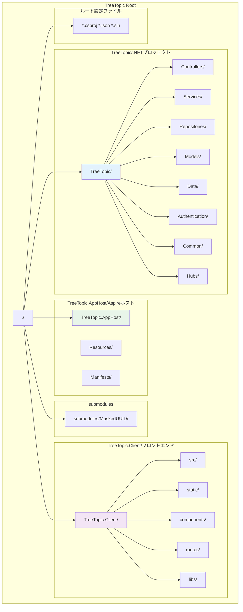
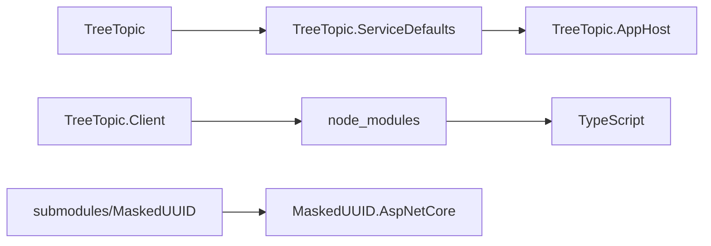

# リポジトリ構造

## TL;DR

TreeTopicリポジトリは4つの主要プロジェクトから構成されます。.NETバックエンド（TreeTopic）、SvelteKitフロントエンド（TreeTopic.Client）、Aspireホスト（TreeTopic.AppHost）、共通ライブラリ（submodules/MaskedUUID）で構成されています。

## ディレクトリ構造



## 主要プロジェクト構造

### 1. TreeTopic (メインWebプロジェクト)

#### ディレクトリ構造
```
TreeTopic/
├── Controllers/           # APIコントローラ
│   ├── AccountController.cs
│   ├── AuthController.cs
│   ├── BrainstormController.cs
│   ├── DefaultUserController.cs
│   ├── FileController.cs
│   ├── MessageController.cs
│   └── PermissionsController.cs
├── Services/              # ビジネスロジックサービス
│   ├── BaseService.cs
│   ├── SetupTokenValidationService.cs
│   └── TenantIdObfuscationService.cs
├── Repositories/          # データアクセス層
│   ├── FileRepository.cs
│   ├── IMessageRepository.cs
│   ├── IRoomPermissionRepository.cs
│   ├── IRoomRepository.cs
│   ├── ITopicRepository.cs
│   ├── RoomPermissionRepository.cs
│   ├── RoomRepository.cs
│   └── TopicRepository.cs
├── Models/                # エンティティモデル
│   ├── ApplicationRole.cs
│   ├── ApplicationTenantDetail.cs
│   ├── ApplicationTenantInfo.cs
│   ├── ApplicationUser.cs
│   ├── BaseModel.cs
│   ├── BrainBoard.cs
│   ├── BrainIdea.cs
│   ├── BrainIdeaVote.cs
│   ├── File.cs
│   ├── Message.cs
│   ├── Permission.cs
│   ├── Room.cs
│   ├── RoomPermission.cs
│   ├── RoomUser.cs
│   ├── SetupToken.cs
│   ├── ShareItem.cs
│   ├── ShareItemFile.cs
│   └── Topic.cs
├── Data/                  # データベース関連
│   ├── TenantCatalogDbContextFactory.cs
│   ├── TenantCatalogDbContext.cs
│   ├── ApplicationDbContext.cs
│   └── MigrationMySqlDbContext.cs
├── Authentication/        # 認証関連
│   ├── CookieAuthenticationConfiguration.cs
│   └── TenantAwareCookieManager.cs
├── Common/               # 共通ユーティリティ
│   ├── Helpers/
│   │   ├── EntityHelper.cs
│   │   ├── ValidationHelper.cs
│   │   └── RoomUserNameHelper.cs
│   ├── Result.cs
│   └── ResultExtensions.cs
├── Hubs/                 # SignalRハブ
│   ├── MessageHub.cs
│   └── RoomTopicHub.cs
├── Program.cs            # アプリケーションエントリーポイント
├── TreeTopic.csproj     # プロジェクトファイル
└── Properties/
    ├── launchSettings.json
    └── AssemblyInfo.cs
```

#### 読み順番（重要度順）
1. **Program.cs** - アプリケーションの起動と設定
2. **Controllers/** - APIエンドポイントの理解
3. **Models/** - データモデルの定義
4. **Services/** - ビジネスロジック
5. **Repositories/** - データアクセスパターン
6. **Data/** - データベースコンテキスト
7. **Authentication/** - 認証フロー
8. **Common/** - 共通ユーティリティ
9. **Hubs/** - リアルタイム通信

### 2. TreeTopic.Client (SvelteKitフロントエンド)

#### ディレクトリ構造
```
TreeTopic.Client/
├── src/
│   ├── lib/              # 共通コンポーネント
│   │   ├── components/
│   │   │   ├── auth/
│   │   │   ├── rooms/
│   │   │   ├── messages/
│   │   │   └── common/
│   │   ├── stores/
│   │   │   ├── auth.store.ts
│   │   │   ├── room.store.ts
│   │   │   └── message.store.ts
│   │   ├── services/
│   │   │   ├── api.service.ts
│   │   │   └── signalr.service.ts
│   │   └── types/
│   │       ├── api.types.ts
│   │       └── auth.types.ts
│   ├── routes/
│   │   +layout.svelte    # レイアウト
│   │   +page.svelte      # ホームページ
│   │   auth/             # 認証関連ルート
│   │   rooms/            # ルーム関連ルート
│   │   topics/           # トピック関連ルート
│   │   └── api/           # APIルート
│   └── app.d.ts          # TypeScript定義
├── static/               # 静的ファイル
│   ├── icons/
│   └── uploads/
├── tests/                # テストファイル
├── package.json
├── vite.config.ts
├── svelte.config.js
└── tsconfig.json
```

#### 読み順番（重要度順）
1. **src/routes/+layout.svelte** - アプリケーションレイアウト
2. **src/lib/types/api.types.ts** - API型定義
3. **src/lib/services/api.service.ts** - API通信サービス
4. **src/lib/stores/** - 状態管理
5. **src/routes/** - ページコンポーネント
6. **src/lib/components/** - 共通コンポーネント
7. **svelte.config.js** - SvelteKit設定
8. **vite.config.ts** - ビルド設定

### 3. TreeTopic.AppHost (Aspireホスト)

#### ディレクトリ構造
```
TreeTopic.AppHost/
├── AppHost.cs           # Aspireホストプログラム
├── appsettings.json     # ホスト設定
├── Properties/
│   └── launchSettings.json
└── Resources/           # マニフェストリソース
    └── manifests/
        └── postgres/    # PostgreSQL設定
```

### 4. submodules/MaskedUUID (マスクUUIDライブラリ)

```
submodules/MaskedUUID/
├── src/
│   └── MaskedUUID.AspNetCore/
│       └── MaskedUUID.AspNetCore.csproj
└── tests/
    └── MaskedUUID.AspNetCore.Tests/
```

## 主要ファイルの役割

### C#プロジェクトファイル
| ファイル | 役割 | 読むべき人 |
|---------|------|----------|
| `TreeTopic.csproj` | 主要プロジェクト定義 | .NET開発者 |
| `TreeTopic.Client/package.json` | フロントエンド依存関係 | フロントエンド開発者 |
| `TreeTopic.AppHost/TreeTopic.AppHost.csproj` | Aspireホスト設定 | DevOpsエンジニア |
| `MaskedUUID.AspNetCore.csproj` | マスクUUIDライブラリ | 全開発者 |

### 重要な設定ファイル
| ファイル | 役割 |
|---------|------|
| `appsettings.json` | 本番環境設定 |
| `appsettings.Development.json` | 開発環境設定 |
| `launchSettings.json` | デバッグ設定 |
| `vite.config.ts` | フロントエンドビルド設定 |
| `svelte.config.js` | SvelteKit設定 |

### 主要なクラス
| カテゴリ | クラス | 役割 |
|----------|-------|------|
| **エントリーポイント** | `Program.cs` | アプリケーション起動 |
| **コントローラ** | `RoomController` | ルーム管理API |
|  | `MessageController` | メッセージAPI |
| **サービス** | `BaseService` | サービス基底クラス |
|  | `RoomManagementService` | ルームビジネスロジック |
|  | `MessageManagementService` | メッセージビジネスロジック |
| **リポジトリ** | `RoomRepository` | ルームデータアクセス |
|  | `MessageRepository` | メッセージデータアクセス |
| **モデル** | `Room` | ルームエンティティ |
|  | `Topic` | トピックエンティティ |
|  | `Message` | メッセージエンティティ |
| **ハブ** | `MessageHub` | メッセージリアルタイム通信 |
|  | `RoomTopicHub` | トピック状態更新 |

## コード依存関係

### 依存関係の流れ
```
Web App (ASP.NET Core)
    ↓ 依存
Controllers
    ↓ 使用
Services
    ↓ 依存
Repositories
    ↓ 使用
Entity Framework Core
    ↓ 接続
PostgreSQL
```

### クライアントサイドの依存関係
```
SvelteKit Components
    ↓ 使用
Stores (状態管理)
    ↓ 通信
API Service
    ↓ 呼び出し
Backend API
    ↓ リアルタイム更新
SignalR
```

## ビルドと実行

### ビルドの依存関係


### 実行の優先順位
1. **TreeTopic.AppHost** - マイクロサービス環境
2. **TreeTopic** - 単体Webアプリ
3. **TreeTopic.Client** - フロントエンド開発サーバー

## テストファイルの場所

### 現在のテスト構成
- **統合テスト**: `TreeTopic.Tests/` (計画中)
- **単体テスト**: `submodules/MaskedUUID/tests/` (MaskedUUIDライブラリ)
- **E2Eテスト**: フロントエンド側で実装

### テスト追加のガイドライン
```bash
# テストプロジェクトの追加
dotnet new xunit -n TreeTopic.Tests
dotnet add TreeTopic.Tests/TreeTopic.Tests.csproj reference TreeTopic/TreeTopic.csproj

# テストの実行
dotnet test TreeTopic.Tests/TreeTopic.Tests.csproj
```

## コーディング規約

### .NETプロジェクト
- **ファイル名**: PascalCase
- **クラス名**: PascalCase
- **メソッド名**: PascalCase
- **変数名**: camelCase
- **定数**: PascalCase + UPPER_CASE

### SvelteKitプロジェクト
- **ファイル名**: kebab-case
- **コンポーネント名**: PascalCase
- **ストア変数**: camelCase
- **イベントハンドラ**: onEventName

### コメント規約
```csharp
// 単一行コメント
/// <summary>
/// XMLドキュメントコメント
/// </summary>
public class Example
{
    /// <param name="param">パラメータ説明</param>
    public void Method(string param)
    {
        // 処理の説明
    }
}
```

---

**コードへの導線**
- **メインプロジェクト**: `TreeTopic/TreeTopic.csproj`
- **バックエントリー**: `TreeTopic/Program.cs`
- **フロントエントリー**: `TreeTopic/TreeTopic.Client/src/routes/+page.svelte`
- **APIコントローラ**: `TreeTopic/Controllers/`
- **ビジネスロジック**: `TreeTopic/Services/`
- **データモデル**: `TreeTopic/Models/`
- **フロントコンポーネント**: `TreeTopic/TreeTopic.Client/src/lib/components/`

**参照 (根拠)**
- `TreeTopic.sln` - ソリューション構造
- `TreeTopic/TreeTopic.csproj` - バックエンド依存関係
- `TreeTopic/TreeTopic.Client/package.json` - フロントエンド依存関係
- `TreeTopic/AppHost/TreeTopic.AppHost.csproj` - Aspire構成
- `submodules/MaskedUUID/` - サブモジュール構成