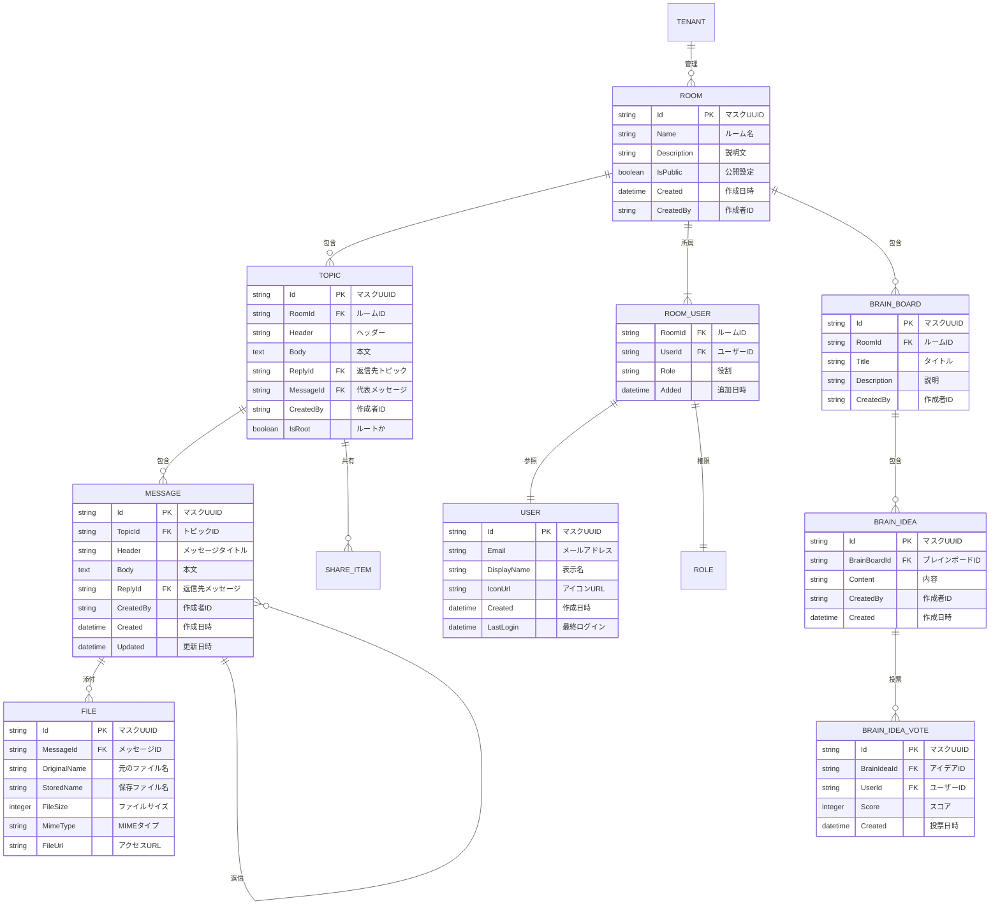
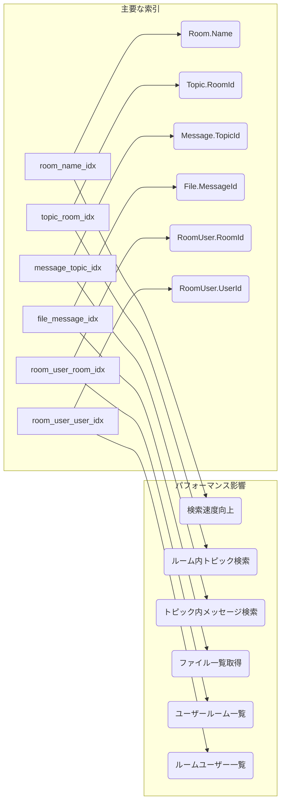
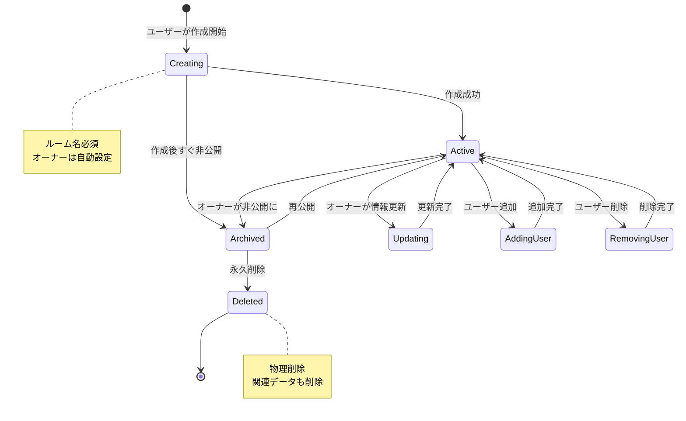
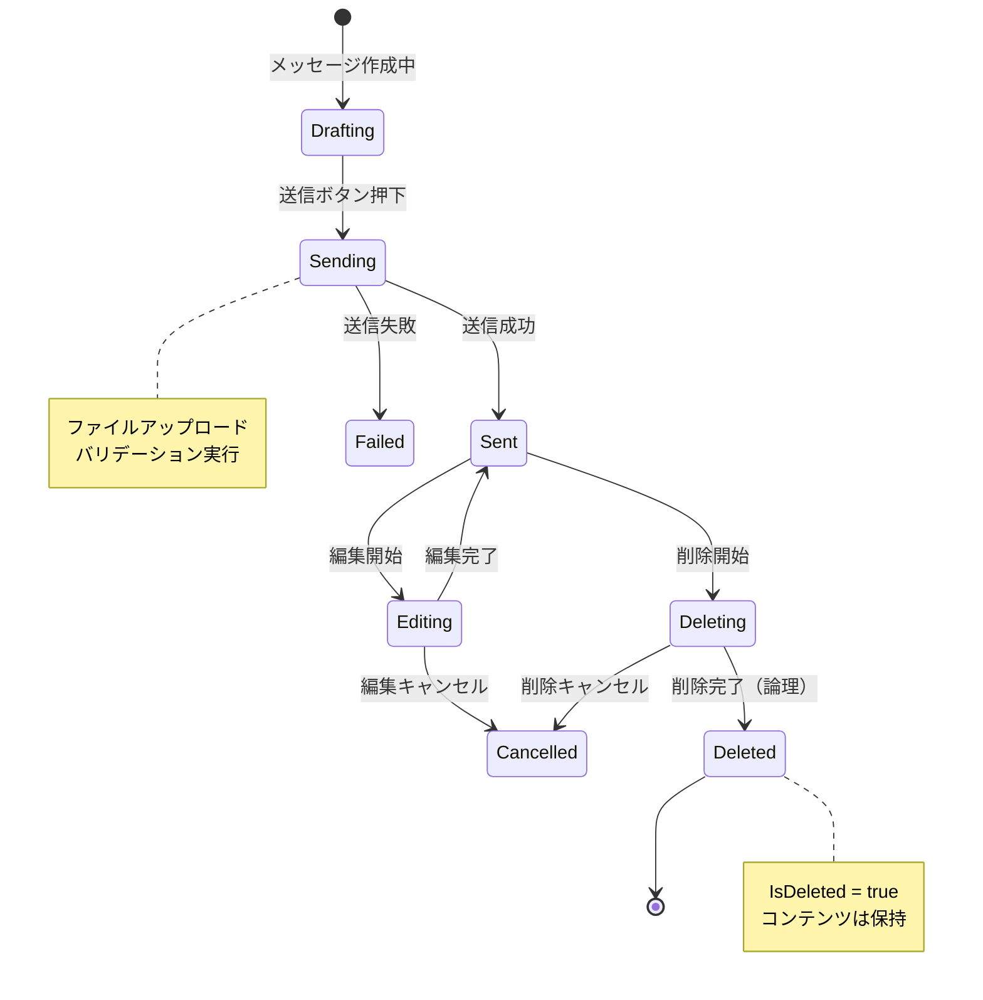
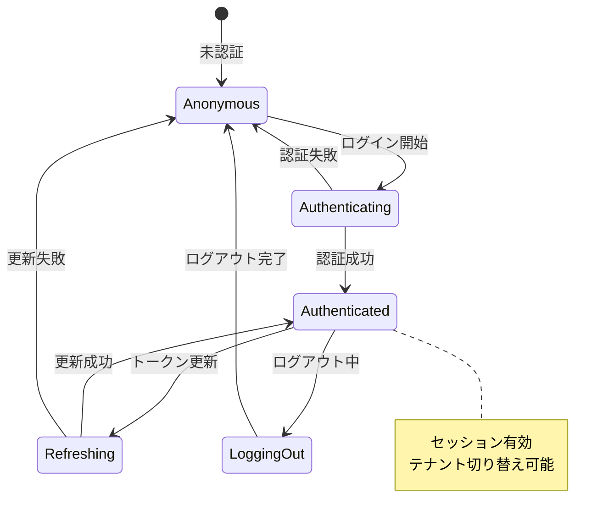

# コア概念

## TL;DR

TreeTopicはマルチテナントを基盤とする議論プラットフォームです。Room（部屋）が議論の単位で、Topic（話題）がメッセージの親子関係を管理し、Messageがコンテンツです。UUIDマスキングによりセキュリティとURL友好性を両立しています。

## ドメイン概念

### 主要概念の関係性

```mermaid
graph TB
    subgraph "主要エンティティ関係"
        User --< RoomUser >-- Room
        Room
        Room
        Room --> Topic --< Message
        Message --> File
        Message
        Room
        ShareItem
        Role --< RoomPermission >-- Room
    end

    subgraph "エンティティ詳細"
        User["User\n(ユーザー)"]
        RoomUser["RoomUser\n(ルームユーザー)\n1:N関連"]
        Room["Room\n(ルーム)\n議論の空間"]
        Topic["Topic\n(トピック)\nメッセージの集まり"]
        Message["Message\n(メッセージ)\n発信内容"]
        File["File\n(ファイル)\n添付ファイル"]
        ShareItem["ShareItem\n(共有アイテム)\n外部共有"]
        Role["Role\n(役割)\n権限レベル"]
        RoomPermission["RoomPermission\n(ルーム権限)\n1:1関連"]
    end

    style User fill:#fff3e0
    style Room fill:#e3f2fd
    style Topic fill:#f3e5f5
    style Message fill:#fce4ec
    style Role fill:#e0f2f1
```

## データモデル詳細

### 主要テーブルの定義



### 索引定義



## 用語集

### テナント (Tenant)
- **定義**: サービスの利用単位。組織やチームなど独立したコミュニティ
- **特性**:
  - 各テナントのデータは完全に分離
  - カスタムOIDCプロバイダーの設定が可能
  - 独自のUIテーマを設定可能
- **例**: `company-a`, `team-b`, `project-c`

### ルーム (Room)
- **定義**: 議論を行う空間。複数のトピックを持つ
- **特性**:
  - プライベート/パブリックの設定可能
  - 参加ユーザーの管理
  - アイコンと説明文の設定
- **プロパティ**:
  - `Id`: マスクされたUUID
  - `Name`: ルーム名（最大255文字）
  - `Description`: 説明文
  - `IconUrl`: アイコン画像URL
  - `IsPublic`: 公開設定
  - `Created`: 作成日時

### トピック (Topic)
- **定義**: メッセージの集まり。階層構造を持ち親子関係を管理
- **特性**:
  - 複数のメッセージを持つ
  - 返信元トピックへの参照
  - 子トピックの作成が可能
- **プロパティ**:
  - `Id`: マスクされたUUID
  - `RoomId`: 所属ルーム
  - `Header`: トピックタイトル（最大500文字）
  - `Body`: 本文
  - `ReplyId`: 返信先トピックID
  - `MessageId`: 代表メッセージID
  - `CreatedBy`: 作成者
  - `IsRoot`: ルートトピックかどうか

### メッセージ (Message)
- **定義**: 実際の発信内容。テキストとファイルを含む
- **特性**:
  - 1メッセージに複数のファイル添付可能
  - 返信元メッセージへの引用
  - 編集・削除可能（作成者のみ）
- **プロパティ**:
  - `Id`: マスクされたUUID
  - `TopicId`: 所属トピック
  - `Header`: メッセージタイトル
  - `Body`: 本文（最大5000文字）
  - `ReplyId`: 返信先メッセージID
  - `CreatedBy`: 作成者
  - `Created`: 作成日時
  - `Updated`: 更新日時

### ファイル (File)
- **定義**: メッセージに添付されたファイル
- **特性**:
  - 最大30MBまでアップロード可能
  - 保存パス: `uploads/{tenantId}/{userId}/{messageId}/`
  - ファイル名はUUIDで一意化
- **プロパティ**:
  - `Id`: マスクされたUUID
  - `MessageId`: 所属メッセージ
  - `OriginalName`: 元のファイル名
  - `StoredName`: 保存時のファイル名
  - `FileSize`: ファイルサイズ（バイト）
  - `MimeType`: MIMEタイプ
  - `FileUrl`: アクセスURL

### ユーザー (User)
- **定義**: サービスを利用する個人
- **認証方式**: OIDCプロバイダー連携
- **プロパティ**:
  - `Id`: マスクされたUUID
  - `Email`: メールアドレス
  - `DisplayName`: 表示名
  - `IconUrl`: アイコンURL
  - `Created`: 作成日時
  - `LastLogin`: 最終ログイン

### 権限 (Permission)
- **定義**: ユーザーのルームアクセス権
- **権限レベル**:
  - `Owner`: オーナー（全権限）
  - `Admin`: 管理者
  - `Member`: メンバー（デフォルト）
  - `Guest`: ゲスト（閲覧のみ）
- **プロパティ**:
  - `RoomId`: ルームID
  - `UserId`: ユーザーID
  - `Role`: 役割
  - `Added`: 追加日時

### 共有アイテム (ShareItem)
- **定義**: 外部共有用のトピックまたはメッセージ
- **特性**:
  - 一意な共有コードを生成
  - パスワード保護可能
  - 有効期限の設定可能
- **プロパティ**:
  - `Id`: マスクされたUUID
  - `ItemType`: アイテムタイプ（Topic/Message）
  - `ItemId`: アイテムID
  - `ShareCode`: 共有コード
  - `Password`: 共有パスワード（暗号化）
  - `Expires`: 有効期限

## 不変条件

### テナント分離の不変条件
```
1. 1つのデータベース接続は1つのテナントに紐付く
2. テナントIDはマスク化されたUUIDで表現される
3. クロステナントのデータアクセスは認証エラーとなる
4. テナントの作成/削除はシステム管理者のみが可能
```

### 階層構造の不変条件
```
1. 1つのトピックは複数のメッセージを持つ（1:N）
2. 1つのメッセージは1つのトピックに所属する（N:1）
3. トピックの親子関係は循環しない（循環参照禁止）
4. ルートトピックはReplyIdを持たない
5. 子トピック作成時に代表メッセージが自動作成される
```

### 権限管理の不変条件
```
1. ルームへのアクセスは必ずRoomPermissionを経由する
2. オーナーはルームの全権限を持ち変更不能
3. ユーザーの権限変更はオーナーまたは管理者のみ
4. ゲストユーザーはメッセージの作成ができない
```

### データ整合性の不変条件
```
1. メッセージの削除は論理削除（IsDeletedフラグ）
2. ファイルの物理削除はメッセージ削除時に行われる
3. テナント削除時は関連データをすべて削除
4. UUIDの生成はv7でマスク化される
```

## 状態遷移図

### ルームの状態遷移



### メッセージの状態遷移



### ユーザーの認証状態遷移



## エラー分類

### APIエラーコード
| コード | エラータイプ | 説明 | 対応 |
|-------|-------------|------|------|
| 400 | BadRequest | リクエスト形式不正 | リクエスト確認 |
| 401 | Unauthorized | 認証が必要 | ログイン確認 |
| 403 | Forbidden | 権限不足 | 権限確認 |
| 404 | NotFound | リソース不存在 | URL確認 |
| 409 | Conflict | リソース競合 | 状態確認 |
| 422 | Unprocessable | バリデーションエラー | 入力値確認 |
| 429 | TooManyRequests | リクエスト過多 | 待機必要 |
| 500 | ServerError | サーバーエラー | 運営者連絡 |

### ビジネスエラー
| 種類 | シナリオ | 処理方法 |
|------|---------|----------|
| **権限エラー** | ルームへのアクセス権がない | 403 Forbidden |
| **存在確認エラー** | 返信先メッセージが存在しない | 404 NotFound |
| **整合性エラー** | メッセージの親子関係矛盾 | 400 BadRequest |
| **サイズ制限エラー** | ファイルサイズ超過 | 422 Unprocessable |
| **リソース枯渇** | ディスク容量不足 | 507 InsufficientStorage |
| **タイムアウト** | データベース接続タイムアウト | 504 GatewayTimeout |

### システムエラー
| 種類 | 発生箇所 | 対応 |
|------|---------|------|
| **接続エラー** | データベース接続 | 再試行必要 |
| **暗号化エラー** | 複合化失敗 | 鍵設定確認 |
| **キャッシュエラー** | メモリキャッシュ不足 | キャッシュクリア |
| **SignalRエラー** | リアルタイム通信接続 | 再接続 |
| **ファイルIOエラー** | アップロード/ダウンロード | ストレージ確認 |

## パフォーマンス特性

### レスポンス時間目標
| 操作 | 95パーセンタイル | 許容範囲 |
|------|----------------|----------|
| APIレスポンス | < 200ms | < 500ms |
| ページ表示 | < 1s | < 3s |
| メッセージ送信 | < 100ms | < 500ms |
| ファイルアップロード | < 1s (1MB) | < 30s (30MB) |
| リアルタイム更新 | < 50ms | < 200ms |

### 同時接続数
| リソース | 最大同時数 | 設計目標 |
|----------|-----------|----------|
| ユーザーセッション | 10,000/テナント | 5,000/テナント |
| データベース接続 | 100 | 50 |
| SignalR接続 | 5,000 | 2,000 |

### テナントあたりのユーザー数
| 項目 | 制限 | 説明 |
|------|------|------|
| **推奨最大** | 1,000ユーザー | パフォーマンスを考慮した推奨値 |
| **技術的制限** | 10,000ユーザー | データベースパフォーマンスの限界値 |
| **アカウント制限** | 制限なし | ユーザーアカウント数自体に制限はありません |
| **アクティブユーザー** | 100ユーザー | 同時アクティブユーザーの推奨値 |

**注意点**:
- 大量のユーザーの場合、データベースのパーティショニングを検討
- キャッシュの最適化が必須
- インデックスの設計がパフォーマンスに影響

## セキュリティ特性

### データ保護レベル
| レベル | 保護対象 | 機密度 |
|-------|----------|--------|
| L1: 表示 | ルーム名、トピックタイトル | 公開 |
| L2: アクセス | メッセージ内容、ファイル | 制限公開 |
| L3: 個人情報 | ユーザー情報、権限 | 内部限定 |
| L4: システム | 暗号化キー、設定 | 管理者限定 |

### 権限継承ルール
```
1. ルームオーナーは自動的に全ての権限を持つ
2. 管理者権限はオーナーから付与・剥奪可能
3. メンバー権限は管理者から付与・剥奪可能
4. ゲスト権限はシステムから自動付与
5. 権限の継承は階層的ではない（明示的付与のみ）
```

---

**コードへの導線**
- **エンティティ定義**: `TreeTopic/Models/`
- **権限管理**: `TreeTopic/Models/Permission.cs`
- **ビジネスルール**: `TreeTopic/Services/`
- **状態管理**: `TreeTopic/Models/BaseModel.cs`
- **エラーハンドリング**: `TreeTopic/Common/Result.cs`

**参照 (根拠)**
- `TreeTopic/Models/Room.cs` - ルームモデル定義
- `TreeTopic/Models/Topic.cs` - トピックモデル定義
- `TreeTopic/Models/Message.cs` - メッセージモデル定義
- `TreeTopic/Models/Permission.cs` - 権限モデル定義
- `TreeTopic/Models/ApplicationUser.cs` - ユーザーモデル定義
- `TreeTopic/Models/BaseModel.cs` - 基底モデル定義
- `TreeTopic/Services/BaseService.cs` - 基底サービス定義
- `TreeTopic/Repositories/` - リポジトリ実装