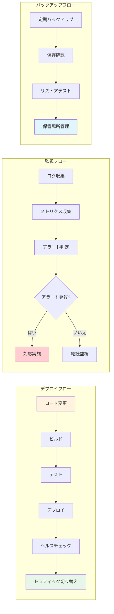

# 運用ガイド

## TL;DR

TreeTopicの運用にはPostgreSQLデータベース、OIDCプロバイダー（Google/Keycloak）、ファイルストレージが必要です。環境変数と設定ファイルを適切に設定し、ログとパフォーマンスを監視することが重要です。

## 運用フロー



## 環境変数

### 必須環境変数

| 変数名 | 説明 | デフォルト値 |
|--------|------|-------------|
| `ASPNETCORE_ENVIRONMENT` | 環境モード | Development |
| `ASPNETCORE_URLS` | アプリケーションURL | http://localhost:5265;https://localhost:7046 |
| `ConnectionStrings__DefaultConnection` | PostgreSQL接続文字列 | - |
| `Encryption__Key` | 暗号化キー（32バイト） | - |
| `Tenant__BaseHost` | ベースホスト名 | - |

### オプション環境変数

| 変数名 | 説明 | デフォルト値 |
|--------|------|-------------|
| `AllowedHosts` | 許可されるホスト | * |
| `Logging__LogLevel__Default` | ログレベル | Information |
| `FileStorage__MaxFileSize` | 最大ファイルサイズ | 31457280 (30MB) |
| `Authentication__Google__ClientId` | Google OAuth Client ID | - |
| `Authentication__Google__ClientSecret` | Google OAuth Client Secret | - |

### 設定ファイル例

#### appsettings.Production.json
```json
{
  "ConnectionStrings": {
    "DefaultConnection": "Host=postgres.internal;Port=5432;Database=treetopic;Username=treetopic;Password=your_secure_password"
  },
  "Encryption": {
    "Key": "your-32-byte-encryption-key-here-please-make-it-long-enough"
  },
  "Logging": {
    "LogLevel": {
      "Default": "Warning",
      "Microsoft.AspNetCore": "Warning",
      "TreeTopic": "Information"
    }
  },
  "AllowedHosts": "app.treetopic.com",
  "FileStorage": {
    "MaxFileSize": 52428800,
    "AllowedExtensions": [".jpg", ".png", ".pdf", ".docx", ".xlsx"]
  },
  "Authentication": {
    "Google": {
      "ClientId": "your-google-client-id",
      "ClientSecret": "your-google-client-secret"
    }
  }
}
```

## デプロイ方法

### Dockerデプロイ

#### docker-compose.yml
```yaml
version: '3.8'
services:
  postgres:
    image: postgres:16
    environment:
      POSTGRES_DB: treetopic
      POSTGRES_USER: treetopic
      POSTGRES_PASSWORD: ${DB_PASSWORD}
    volumes:
      - postgres_data:/var/lib/postgresql/data
    ports:
      - "5432:5432"
    healthcheck:
      test: ["CMD-SHELL", "pg_isready -U treetopic"]
      interval: 10s
      timeout: 5s
      retries: 5

  webapp:
    image: treetopic:latest
    environment:
      - ASPNETCORE_ENVIRONMENT=Production
      - ConnectionStrings__DefaultConnection=Host=postgres;Port=5432;Database=treetopic;Username=treetopic;Password=${DB_PASSWORD}
      - Encryption__Key=${ENCRYPTION_KEY}
      - Tenant__BaseHost=${TENANT_HOST}
    ports:
      - "80:8080"
      - "443:8081"
    depends_on:
      postgres:
        condition: service_healthy
    volumes:
      - ./uploads:/app/uploads
      - ./logs:/app/logs

volumes:
  postgres_data:
```

#### デプロイコマンド
```bash
# 環境変数ファイル作成
cat > .env << EOF
DB_PASSWORD=your_secure_password
ENCRYPTION_KEY=your-32-byte-encryption-key
TENANT_HOST=your-domain.com
EOF

# ビルドとデプロイ
docker-compose build
docker-compose up -d

# ログ確認
docker-compose logs -f webapp
```

### Kubernetesデプロイ

#### deployment.yaml
```yaml
apiVersion: apps/v1
kind: Deployment
metadata:
  name: treetopic
spec:
  replicas: 3
  selector:
    matchLabels:
      app: treetopic
  template:
    metadata:
      labels:
        app: treetopic
    spec:
      containers:
      - name: treetopic
        image: treetopic:latest
        ports:
        - containerPort: 8080
        env:
        - name: ASPNETCORE_ENVIRONMENT
          value: "Production"
        - name: ConnectionStrings__DefaultConnection
          valueFrom:
            secretKeyRef:
              name: treetopic-secrets
              key: db-connection
        - name: Encryption__Key
          valueFrom:
            secretKeyRef:
              name: treetopic-secrets
              key: encryption-key
        resources:
          requests:
            memory: "512Mi"
            cpu: "250m"
          limits:
            memory: "1Gi"
            cpu: "500m"
        livenessProbe:
          httpGet:
            path: /health
            port: 8080
          initialDelaySeconds: 30
          periodSeconds: 10
        readinessProbe:
          httpGet:
            path: /healthz
            port: 8080
          initialDelaySeconds: 5
          periodSeconds: 5
```

#### secrets.yaml
```yaml
apiVersion: v1
kind: Secret
metadata:
  name: treetopic-secrets
type: Opaque
data:
  db-connection: <base64-encoded-connection-string>
  encryption-key: <base64-encoded-key>
```

### Helmチャートでのデプロイ

#### values.yaml
```yaml
replicaCount: 3

image:
  repository: treetopic
  pullPolicy: Always
  tag: "latest"

service:
  type: LoadBalancer
  port: 80

ingress:
  enabled: true
  hosts:
    - host: your-domain.com
      paths: ["/"]

secrets:
  dbPassword: "your-password"
  encryptionKey: "your-32-byte-key"
  googleClientId: "your-google-client-id"
  googleClientSecret: "your-google-client-secret"

resources:
  limits:
    cpu: 500m
    memory: 1Gi
  requests:
    cpu: 250m
    memory: 512Mi

autoscaling:
  enabled: true
  minReplicas: 2
  maxReplicas: 10
  targetCPUUtilizationPercentage: 70
```

## ログと監視

### ログ設定

#### ログレベル
| レベル | 説明 | 推奨環境 |
|-------|------|----------|
| Trace | 詳細なトレース情報 | Development |
| Debug | デバッグ情報 | Development |
| Information | 一般的な情報 | Production |
| Warning | 警告情報 | Production |
| Error | エラー情報 | Production |
| Critical | 致命的なエラー | Production |

#### ログ出力先
- **コンソール**: 開発環境向け
- **ファイル**: `/var/log/treetopic/` にローテーション
- **外部サービス**: Application Insights, Datadog, New Relic

#### ログフォーマット
```json
{
  "timestamp": "2024-01-01T00:00:00.000Z",
  "level": "Information",
  "category": "TreeTopic.Controllers.MessageController",
  "event": "CreateMessageAsync",
  "message": "メッセージが作成されました",
  "properties": {
    "tenantId": "tenant-uuid",
    "roomId": "room-uuid",
    "topicId": "topic-uuid",
    "userId": "user-uuid",
    "duration": 123,
    "status": "Success"
  }
}
```

### パフォーマンス監視

#### メトリクス
| メトリクス | 説明 | アラート設定 |
|-----------|------|-------------|
| Request Duration | リクエスト処理時間 | > 1000ms |
| Error Rate | エラー率 | > 1% |
| Active Connections | アクティブ接続数 | > 1000 |
| Memory Usage | メモリ使用量 | > 80% |
| CPU Usage | CPU使用率 | > 80% |

#### OpenTelemetry設定
```csharp
// Program.cs
builder.Services.AddOpenTelemetry()
    .WithTracing(tracing => tracing
        .AddSource("TreeTopic")
        .AddAspNetCoreInstrumentation()
        .AddSqlClientInstrumentation()
        .AddConsoleExporter())
    .WithMetrics(metrics => metrics
        .AddMeter("TreeTopic")
        .AddAspNetCoreInstrumentation()
        .AddPrometheusExporter());
```

### アラート設定

#### Prometheus AlertManager
```yaml
groups:
- name: treetopic
  rules:
  - alert: HighErrorRate
    expr: rate(http_requests_total{status=~"5.."}[5m]) > 0.1
    for: 5m
    labels:
      severity: critical
    annotations:
      summary: "High error rate detected"
      description: "Error rate is {{ $value }} errors per second"
```

#### Slack通知
```yaml
receivers:
- name: slack-notifications
  slack_configs:
  - api_url: https://hooks.slack.com/services/YOUR/SLACK/WEBHOOK
    channel: '#alerts'
    title: '{{ .GroupNames }} / {{ .Alerts.Firing | len }} firing'
    text: '{{ range .Alerts }}{{ .Annotations.summary }}\n{{ end }}'
```

## バックアップとリストア

### データベースバックアップ

#### pg_dumpを使ったバックアップ
```bash
# 完全バックアップ
pg_dump -h localhost -U treetopic -d treetopic > backup-$(date +%Y%m%d).sql

# カスタムフォーマット
pg_dump -h localhost -U treetopic -d treetopic -Fc > backup-$(date +%Y%m%d).dump

# バックアップの確認
pg_restore -l backup-20240101.dump
```

#### 自動バックアップスクリプト
```bash
#!/bin/bash
# backup.sh

BACKUP_DIR="/backups"
DATE=$(date +%Y%m%d_%H%M%S)
RETENTION_DAYS=30

# バックアップ実行
pg_dump -h $DB_HOST -U $DB_USER -d $DB_NAME | gzip > $BACKUP_DIR/treetopic_$DATE.sql.gz

# 古いバックアップの削除
find $BACKUP_DIR -name "treetopic_*.sql.gz" -mtime +$RETENTION_DAYS -delete

# 成功通知
echo "Backup completed: treetopic_$DATE.sql.gz"
```

### ファイルストレージバックアップ
```bash
# アップロードファイルのバックアップ
tar -czf uploads_backup_$(date +%Y%m%d).tar.gz /path/to/uploads

# S3へのアップロード
aws s3 cp uploads_backup_20240101.tar.gz s3://your-backup-bucket/treetopic/
```

### リストア手順

#### データベースリストア
```bash
# SQLファイルからのリストア
psql -h localhost -U treetopic -d treetopic < backup-20240101.sql

# カスタムフォーマットからのリストア
pg_restore -h localhost -U treetopic -d treetopic backup-20240101.dump
```

#### リストアチェックリスト
1. データベース接続を確認
2. アプリケーションを停止
3. データベースバックアップをリストア
4. 暗号化キーを確認
5. アプリケーションを起動
6. データ整合性を確認

## ロールバック手順

### デプロイ失敗時のロールバック

#### Docker Composeの場合
```bash
# 前のバージョンにロールバック
docker-compose down
docker-compose up -d

# 特定のバージョンにロールバック
docker-compose down
docker tag treetopic:previous-version treetopic:latest
docker-compose up -d
```

#### Kubernetesの場合
```bash
# デプロイメントのロールバック
kubectl rollout undo deployment/treetopic
kubectl rollout status deployment/treetopic

# ロールバックの確認
kubectl rollout history deployment/treetopic
```

### データベースマイグレーションのロールバック
```bash
# マイグレーションのロールバック
dotnet ef database update PreviousMigration

# 特定のバージョンにロールバック
dotnet ef database update 20240101120000
```

## スケーリング

### 水平スケーリング

#### Webサーバーのスケーリング
```yaml
# Kubernetes Horizontal Pod Autoscaler
apiVersion: autoscaling/v2
kind: HorizontalPodAutoscaler
metadata:
  name: treetopic-hpa
spec:
  scaleTargetRef:
    apiVersion: apps/v1
    kind: Deployment
    name: treetopic
  minReplicas: 2
  maxReplicas: 10
  metrics:
  - type: Resource
    resource:
      name: cpu
      target:
        type: Utilization
        averageUtilization: 70
  - type: Resource
    resource:
      name: memory
      target:
        type: Utilization
        averageUtilization: 80
```

#### データベーススケーリング
1. **読み取り専用レプリカの追加**
   ```sql
   -- レプリカ作成
   CREATE DATABASE treetopic_replica WITH TEMPLATE treetopic CONNECTION LIMIT -1;

   -- レプリカの確認
   SELECT * FROM pg_stat_replication;
   ```

2. **読み込み分散の設定**
   ```yaml
   # プロキシ設定（例: HAProxy）
   frontend http-in
     bind *:80
     default_backend treetopic-backend

   backend treetopic-backend
     balance roundrobin
     server master db-master:5432 check
     server replica1 db-replica1:5432 check
     server replica2 db-replica2:5432 check
   ```

### 垂直スケーリング

#### リソース要件の推奨値
| コンポーネント | 最小 | 推奨 | 最大 |
|---------------|------|------|------|
| Webサーバー | 2vCPU, 4GB RAM | 4vCPU, 8GB RAM | 8vCPU, 16GB RAM |
| データベース | 4vCPU, 8GB RAM | 8vCPU, 16GB RAM | 16vCPU, 32GB RAM |
| ファイルストレージ | 100GB | 500GB | 2TB |

#### スケジュールされたスケーリング
```bash
# スケジューリング例（cron）
# 毎日9時にスケールアップ
0 9 * * * kubectl scale deployment treetopic --replicas=5

# 毎日18時にスケールダウン
0 18 * * * kubectl scale deployment treetopic --replicas=2
```

## セキュリティ対策

### 定期的なセキュリティチェック

#### 依存関係の脆弱性スキャン
```bash
# Trivyを使ったスキャン
trivy image --exit-code 0 --severity CRITICAL,HIGH treetopic:latest

# npmの脆弱性チェック
npm audit --audit-level moderate
```

#### シークレットスキャン
```bash
# truffleHogを使ったシークレット検出
truffleHog --regex --entropy=False .
```

### 証明書の更新

#### Let's Encrypt証明書の自動更新
```bash
# certbotの設定
certbot renew --dry-run

# Kubernetesでの証明書管理
kubectl apply -f cert-manager.yaml
```

### ファイアウォール設定

#### AWS Security Groups
```json
{
  "Description": "TreeTopic Security Group",
  "GroupId": "sg-1234567890abcdef0",
  "IpPermissions": [
    {
      "FromPort": 80,
      "IpProtocol": "tcp",
      "IpRanges": [
        {
          "CidrIp": "0.0.0.0/0",
          "Description": "HTTP"
        }
      ],
      "ToPort": 80
    },
    {
      "FromPort": 443,
      "IpProtocol": "tcp",
      "IpRanges": [
        {
          "CidrIp": "0.0.0.0/0",
          "Description": "HTTPS"
        }
      ],
      "ToPort": 443
    }
  ],
  "IpPermissionsEgress": [
    {
      "FromPort": 0,
      "IpProtocol": "-1",
      "IpRanges": [
        {
          "CidrIp": "0.0.0.0/0"
        }
      ],
      "ToPort": 0
    }
  ],
  "GroupName": "treetopic-sg",
  "VpcId": "vpc-1234567890abcdef0"
}
```

## トラブルシューティング

### 常見の問題

#### データベース接続エラー
```bash
# 接続確認
psql -h localhost -U treetopic -d treetopic -c "SELECT 1"

# 接続プールの確認
SELECT * FROM pg_stat_activity WHERE state = 'active';
```

#### メモリ不足エラー
```bash
# メモリ使用量の確認
free -h
kubectl top pods

# OOM killerのログ確認
dmesg | grep -i "killed process"
```

#### ファイルシステムの空き容量
```bash
# ディスク使用量の確認
df -h
kubectl exec -it <pod> -- df -h

# ログファイルの確認
ls -lh /var/log/treetopic/
```

### パフォーマンス問題

#### 慢いクエリの特定
```sql
-- スロークエリのログ
SET log_min_duration_statement = 1000;

-- 実行計画の確認
EXPLAIN ANALYZE SELECT * FROM messages WHERE topic_id = 'topic-uuid';
```

#### キャッシュの効率化
```bash
# Redisキャッシュの確認（実装される場合）
redis-cli info memory
redis-cli stats
```

---

**コードへの導線**
- **設定ファイル**: `TreeTopic/appsettings.json`
- **環境設定**: `TreeTopic/Program.cs` (環境変数の読み取り)
- **デプロイ設定**: `TreeTopic/Dockerfile`
- **マイグレーション**: `TreeTopic/Data/`
- **ログ設定**: `TreeTopic/Program.cs` (ロギングの構成)

**参照 (根拠)**
- `TreeTopic/appsettings.json` - 基本設定
- `TreeTopic/appsettings.Development.json` - 開発環境設定
- `TreeTopic/Program.cs` - アプリケーション設定
- `TreeTopic/Dockerfile` - Docker設定
- `TreeTopic.AppHost/` - Aspire設定
- `TreeTopic/Authentication/CookieAuthenticationConfiguration.cs` - 認証設定