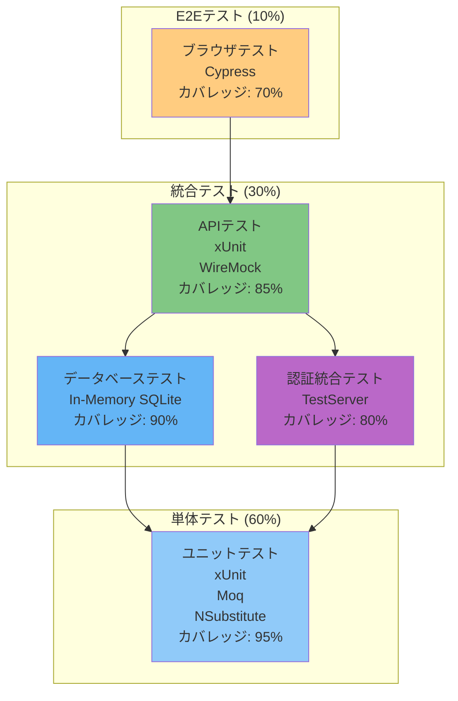

# テスト戦略

## TL;DR

TreeTopicのテスト戦略は単体テスト、統合テスト、E2Eテストの3層構造を採用しています。.NET Testing + xUnitとJest + Testing Libraryを使用し、テストカバレッジ目標は80%以上です。

## テストの種類

### テストピラミッド



## 単体テスト

### テスト対象
| 対象 | ツール | カバレッジ目標 | テスト例 |
|------|-------|-------------|----------|
| ビジネスロジック | xUnit + Moq | 95% | RoomServiceのCreateRoom |
| リポジトリ | xUnit + In-Memory | 90% | RoomRepositoryのAddAsync |
| ユーティリティ | xUnit | 100% | ValidationHelperのIsValidEmail |
| コントローラ | xUnit + Moq | 85% | AuthControllerのLogin |

### テスト例

#### サービス層のテスト
```csharp
// TreeTopic.Tests/Services/RoomManagementServiceTests.cs
[TestClass]
public class RoomManagementServiceTests
{
    private Mock<IRoomRepository> _mockRoomRepository;
    private Mock<IRoomPermissionRepository> _mockPermissionRepository;
    private RoomManagementService _service;

    [TestInitialize]
    public void Setup()
    {
        _mockRoomRepository = new Mock<IRoomRepository>();
        _mockPermissionRepository = new Mock<IRoomPermissionRepository>();
        _service = new RoomManagementService(
            _mockRoomRepository.Object,
            _mockPermissionRepository.Object,
            Mock.Of<ILogger<RoomManagementService>>());
    }

    [TestMethod]
    public async Task CreateRoomAsync_ValidRequest_ReturnsSuccess()
    {
        // Arrange
        var request = new CreateRoomRequest
        {
            Name = "Test Room",
            Description = "Test Description"
        };
        var userId = Guid.NewGuid();

        var room = new Room
        {
            Id = Guid.NewGuid(),
            Name = "Test Room",
            Description = "Test Description",
            CreatedBy = userId,
            Created = DateTime.UtcNow
        };

        _mockRoomRepository.Setup(x => x.AddAsync(It.IsAny<Room>()))
            .Callback<Room>(r => r.Id = room.Id)
            .Returns(Task.CompletedTask);

        // Act
        var result = await _service.CreateRoomAsync(request, userId);

        // Assert
        Assert.IsTrue(result.Success);
        Assert.AreEqual("Test Room", result.Data?.Name);
        _mockRoomRepository.Verify(x => x.AddAsync(It.IsAny<Room>()), Times.Once);
    }

    [TestMethod]
    public async Task CreateRoomAsync_DuplicateName_ReturnsFailure()
    {
        // Arrange
        var request = new CreateRoomRequest { Name = "Existing Room" };
        var userId = Guid.NewGuid();

        _mockRoomRepository.Setup(x => x.FindByNameAsync("Existing Room"))
            .ReturnsAsync(new Room()); // 既存のルームが存在する

        // Act
        var result = await _service.CreateRoomAsync(request, userId);

        // Assert
        Assert.IsFalse(result.Success);
        Assert.AreEqual("Room name already exists", result.Error?.Message);
    }
}
```

#### リポジトリ層のテスト
```csharp
// TreeTopic.Tests/Repositories/RoomRepositoryTests.cs
[TestClass]
public class RoomRepositoryTests
{
    private ApplicationDbContext _context;
    private RoomRepository _repository;

    [TestInitialize]
    public void Setup()
    {
        var options = new DbContextOptionsBuilder<ApplicationDbContext>()
            .UseInMemoryDatabase(databaseName: Guid.NewGuid().ToString())
            .Options;

        _context = new ApplicationDbContext(options);
        _repository = new RoomRepository(_context);
    }

    [TestMethod]
    public async Task AddAsync_AddsRoomToDatabase()
    {
        // Arrange
        var room = new Room
        {
            Name = "Test Room",
            CreatedBy = Guid.NewGuid()
        };

        // Act
        await _repository.AddAsync(room);
        await _context.SaveChangesAsync();

        // Assert
        var savedRoom = await _context.Rooms.FindAsync(room.Id);
        Assert.IsNotNull(savedRoom);
        Assert.AreEqual("Test Room", savedRoom.Name);
    }
}
```

### テストの実行

#### 単体テストの実行
```bash
# 特定のテストプロジェクト
dotnet test TreeTopic.Tests/TreeTopic.Tests.csproj

# カバレッジ付きで実行
dotnet test TreeTopic.Tests/TreeTopic.Tests.csproj \
    --collect:"XPlat Code Coverage" \
    --results-directory TestResults

# テストフィルター
dotnet test TreeTopic.Tests/TreeTopic.Tests.csproj \
    --filter "TestCategory=Integration"
```

#### カバレッジレポートの生成
```bash
# カバレッジレポートの整形
reportgenerator -reports:TestResults/coverage.xml \
                -targetdir:TestResults/coverage \
                -reporttypes:Html;Cobertura

# コードカバレッジの確認
open TestResults/coverage/index.html
```

## 統合テスト

### テスト対象
| 対象 | ツール | テスト例 |
|------|-------|----------|
| APIエンドポイント | TestServer + xUnit | RoomControllerのPOST /api/rooms |
| データベース操作 | PostgreSQLテストコンテナ | テナントデータの分離検証 |
| 認証フロー | TestServer + OIDCモック | ログイン/ログアウトのフロー |
| SignalR接続 | SignalR Test Server | メッセージ配信の検証 |

### テスト例

#### API統合テスト
```csharp
// TreeTopic.Tests.Integration/Controllers/RoomControllerTests.cs
[TestClass]
public class RoomControllerTests : IntegrationTestBase
{
    [TestMethod]
    public async Task CreateRoom_Returns201WhenValidRequest()
    {
        // Arrange
        var client = CreateClient();
        var request = new
        {
            Name = "Integration Test Room",
            Description = "Test Description"
        };

        // Act
        var response = await client.PostAsJsonAsync("/api/rooms", request);

        // Assert
        response.EnsureSuccessStatusCode();
        response.StatusCode.Should().Be(HttpStatusCode.Created);

        var content = await response.Content.ReadAsStringAsync();
        var result = JsonConvert.DeserializeObject<RoomDto>(content);
        result.Should().NotBeNull();
        result.Name.Should().Be("Integration Test Room");
    }

    [TestMethod]
    public async Task CreateRoom_Returns400WhenInvalidRequest()
    {
        // Arrange
        var client = CreateClient();
        var request = new { Name = "" }; // 空の名前

        // Act
        var response = await client.PostAsJsonAsync("/api/rooms", request);

        // Assert
        response.StatusCode.Should().Be(HttpStatusCode.BadRequest);
    }
}
```

#### 認統合テスト
```csharp
// TreeTopic.Tests.Integration/Authentication/AuthControllerTests.cs
[TestClass]
public class AuthControllerTests : IntegrationTestBase
{
    [TestMethod]
    public async Task Login_RedirectsToOidcProvider()
    {
        // Arrange
        var client = CreateClient();

        // Act
        var response = await client.GetAsync("/auth/login");

        // Assert
        response.StatusCode.Should().Be(HttpStatusCode.Redirect);
        response.Headers.Location.ToString()
            .Should().Contain("signin-oidc");
    }

    [TestMethod]
    public async Task Me_ReturnsUser_WhenAuthenticated()
    {
        // Arrange
        var client = CreateClient();
        await AuthenticateAsync(client);

        // Act
        var response = await client.GetAsync("/auth/me");

        // Assert
        response.EnsureSuccessStatusCode();
        var content = await response.Content.ReadAsStringAsync();
        var user = JsonConvert.DeserializeObject<UserDto>(content);
        user.Should().NotBeNull();
        user.Email.Should().NotBeNullOrEmpty();
    }
}
```

### テストベースクラス
```csharp
// TreeTopic.Tests.Integration/IntegrationTestBase.cs
public abstract class IntegrationTestBase : IDisposable
{
    protected readonly WebApplicationFactory<Program> Factory;
    protected readonly HttpClient Client;
    protected readonly ApplicationDbContext DbContext;

    protected IntegrationTestBase()
    {
        Factory = new WebApplicationFactory<Program>()
            .WithWebHostBuilder(builder =>
            {
                builder.ConfigureTestServices(services =>
                {
                    // In-memoryデータベースでテスト
                    var connectionString = "Server=localhost;Database=treetopic_test;User ID=treetopic;Password=test";
                    services.AddDbContext<ApplicationDbContext>(options =>
                        options.UseNpgsql(connectionString));

                    // テスト用OIDC設定
                    services.AddAuthentication("Test")
                        .AddCookie("Test", options =>
                        {
                            options.Events = new CookieAuthenticationEvents
                            {
                                OnValidatePrincipal = context =>
                                {
                                    // テスト用の偽造プリンシパル
                                    context.Principal = new ClaimsPrincipal(
                                        new ClaimsIdentity(
                                            new[]
                                            {
                                                new Claim(ClaimTypes.NameIdentifier, "test-user-id"),
                                                new Claim(ClaimTypes.Email, "test@example.com"),
                                                new Claim(ClaimTypes.Name, "Test User")
                                            },
                                            "Test"));
                                    return Task.CompletedTask;
                                }
                            };
                        });
                });
            });

        Client = Factory.CreateClient();

        // データベースコンテキストの取得
        var scope = Factory.Services.CreateScope();
        DbContext = scope.ServiceProvider.GetRequiredService<ApplicationDbContext>();
    }

    protected async Task AuthenticateAsync(HttpClient client, string userId = "test-user-id")
    {
        client.DefaultRequestHeaders.Authorization =
            new AuthenticationHeaderValue("Test", "test-token");
    }

    public void Dispose()
    {
        Factory?.Dispose();
        Client?.Dispose();
        DbContext?.Dispose();
    }
}
```

## E2Eテスト

### テストツール
- **Cypress**: ブラウザ自動化テスト
- **Testing Library**: アクセシビリティ重視のテスト
- **Playwright**: マルチブラウザ対応（将来対応）

### テスト対象
| シナリオ | 説明 | テスト数 |
|---------|------|---------|
| 認証フロー | ログインからログアウトまで | 3 |
| ルーム操作 | 作成、更新、削除 | 5 |
| メッセージ送信 | 投稿、編集、削除 | 7 |
| UI応答性 | 各操作の応答速度 | 5 |
| リアルタイム更新 | SignalRの配信確認 | 4 |

### テスト例

#### Cypressテスト
```javascript
// cypress/e2e/room.spec.js
describe('Room Operations', () => {
    beforeEach(() => {
        cy.login();
        cy.visit('/rooms');
    });

    it('should create a new room', () => {
        // 新規ルーム作成ボタンクリック
        cy.get('[data-testid="create-room"]').click();

        // モーダルが表示されるのを確認
        cy.get('.modal').should('be.visible');

        // フォームに入力
        cy.get('[name="name"]').type('Test Room E2E');
        cy.get('[name="description"]').type('E2E Test Description');

        // 送信
        cy.get('form').submit();

        // リストに表示されるのを確認
        cy.get('.room-list').should('contain', 'Test Room E2E');
    });

    it('should join a room', () => {
        // ルームをクリック
        cy.get('.room-item').first().click();

        // ルームページに遷移
        cy.url().should('include', '/rooms/');

        // 参加ボタンが表示される
        cy.get('[data-testid="join-room"]').should('be.visible');

        // 参加ボタンをクリック
        cy.get('[data-testid="join-room"]').click();

        // ユーザーリストに自分が表示される
        cy.get('.user-list').should('contain', 'Test User');
    });

    it('should update room settings', () => {
        // ルーム設定ボタンをクリック
        cy.get('[data-testid="room-settings"]').click();

        // 設定画面が表示される
        cy.get('.settings-modal').should('be.visible');

        // 名前を更新
        cy.get('[name="name"]').clear().type('Updated Room Name');

        // 保存
        cy.get('[data-testid="save-settings"]').click();

        // 変更が反映される
        cy.get('.room-header').should('contain', 'Updated Room Name');
    });
});

// cypress/support/commands.js
Cypress.Commands.add('login', () => {
    cy.session('login', () => {
        cy.visit('/auth/login');
        cy.get('#email').type('test@example.com');
        cy.get('#password').type('password123');
        cy.get('form').submit();
        cy.url().should('not.include', '/auth/login');
    });
});
```

#### マルチブラウザテスト
```javascript
// cypress.config.js
const { defineConfig } = require('cypress');

module.exports = defineConfig({
    e2e: {
        viewportWidth: 1280,
        viewportHeight: 720,
        baseUrl: 'http://localhost:3000',
        specPattern: 'cypress/e2e/**/*.cy.{js,jsx,ts,tsx}',
        supportFile: 'cypress/support/e2e.{js,jsx,ts,tsx}',
        setupNodeEvents(on, config) {
            // マルチブラウザ設定
            config.browser = config.env.browser || 'chrome';

            if (config.env.browser === 'firefox') {
                config.browser = 'firefox';
            } else if (config.env.browser === 'edge') {
                config.browser = 'edge';
            }

            return config;
        }
    }
});
```

## テストデータ管理

### テストデータの定義

#### テストユーザー
```csharp
// TreeTopic.Tests/SeedData/TestUsers.cs
public static class TestUsers
{
    public static readonly User Admin = new User
    {
        Id = Guid.Parse("00000000-0000-0000-0000-000000000001"),
        Email = "admin@test.com",
        DisplayName = "Admin User",
        Created = DateTime.UtcNow
    };

    public static readonly User Member = new User
    {
        Id = Guid.Parse("00000000-0000-0000-0000-000000000002"),
        Email = "member@test.com",
        DisplayName = "Member User",
        Created = DateTime.UtcNow
    };
}
```

#### テストルーム
```csharp
// TreeTopic.Tests/SeedData/TestRooms.cs
public static class TestRooms
{
    public static readonly Room PublicRoom = new Room
    {
        Id = Guid.Parse("00000000-0000-0000-0000-000000000001"),
        Name = "Public Test Room",
        Description = "Public room for testing",
        IsPublic = true,
        CreatedBy = TestUsers.Admin.Id,
        Created = DateTime.UtcNow
    };

    public static readonly Room PrivateRoom = new Room
    {
        Id = Guid.Parse("00000000-0000-0000-0000-000000000002"),
        Name = "Private Test Room",
        Description = "Private room for testing",
        IsPublic = false,
        CreatedBy = TestUsers.Member.Id,
        Created = DateTime.UtcNow
    };
}
```

### テストデータの設定
```csharp
// TreeTopic.Tests/Data/TestDataSeeder.cs
public class TestDataSeeder
{
    private readonly ApplicationDbContext _context;

    public TestDataSeeder(ApplicationDbContext context)
    {
        _context = context;
    }

    public async void Seed()
    {
        // ユーザーをシード
        await _context.Users.AddRangeAsync(
            TestUsers.Admin,
            TestUsers.Member);

        // ルームをシード
        await _context.Rooms.AddRangeAsync(
            TestRooms.PublicRoom,
            TestRooms.PrivateRoom);

        // 権限をシード
        await _context.RoomPermissions.AddRangeAsync(
            new RoomPermission
            {
                RoomId = TestRooms.PublicRoom.Id,
                UserId = TestUsers.Admin.Id,
                Role = Role.Owner,
                Added = DateTime.UtcNow
            },
            new RoomPermission
            {
                RoomId = TestRooms.PrivateRoom.Id,
                UserId = TestUsers.Member.Id,
                Role = Role.Member,
                Added = DateTime.UtcNow
            });

        await _context.SaveChangesAsync();
    }
}
```

## CI/CDパイプライン

### GitHub Actionsワークフロー

#### テストワークフロー
```yaml
# .github/workflows/test.yml
name: Tests

on:
  push:
    branches: [ main, develop ]
  pull_request:
    branches: [ main ]

jobs:
  test:
    runs-on: ubuntu-latest

    services:
      postgres:
        image: postgres:15
        env:
          POSTGRES_USER: treetopic
          POSTGRES_PASSWORD: testpass
          POSTGRES_DB: treetopic_test
        ports:
          - 5432:5432
        options: --health-cmd pg_isready --health-interval 10s --health-timeout 5s --health-retries 5

    strategy:
      matrix:
        project: [TreeTopic.Tests, TreeTopic.Tests.Integration]
        dotnet-version: [8.0.100]

    steps:
    - uses: actions/checkout@v3
      with:
        submodules: recursive

    - name: Setup .NET
      uses: actions/setup-dotnet@v3
      with:
        dotnet-version: ${{ matrix.dotnet-version }}

    - name: Setup Node.js
      uses: actions/setup-node@v3
      with:
        node-version: '20'
        cache: 'npm'

    - name: Install dependencies
      run: |
        dotnet restore
        cd TreeTopic/TreeTopic.Client && npm install

    - name: Build
      run: |
        dotnet build --no-restore

    - name: Run unit tests
      if: matrix.project == 'TreeTopic.Tests'
      run: |
        dotnet test TreeTopic.Tests/TreeTopic.Tests.csproj \
          --configuration Release \
          --logger "junit;LogFilePath=test-results.xml" \
          --collect:"XPlat Code Coverage"

    - name: Run integration tests
      if: matrix.project == 'TreeTopic.Tests.Integration'
      run: |
        dotnet test TreeTopic.Tests.Integration/TreeTopic.Tests.Integration.csproj \
          --configuration Release \
          --logger "junit;LogFilePath=integration-results.xml"

    - name: Upload test results
      uses: actions/upload-artifact@v3
      if: always()
      with:
        name: test-results-${{ matrix.project }}
        path: |
          test-results.xml
          integration-results.xml

    - name: Upload coverage to Codecov
      uses: codecov/codecov-action@v3
      with:
        file: ./TestResults/coverage.xml
        flags: unittests
        name: codecov-umbrella
```

#### E2Eテストワークフロー
```yaml
# .github/workflows/e2e.yml
name: E2E Tests

on:
  push:
    branches: [ main ]
  pull_request:
    branches: [ main ]

jobs:
  e2e:
    runs-on: ubuntu-latest

    steps:
    - uses: actions/checkout@v3

    - name: Setup Node.js
      uses: actions/setup-node@v3
      with:
        node-version: '20'
        cache: 'npm'

    - name: Install dependencies
      run: |
        cd TreeTopic/TreeTopic.Client && npm install

    - name: Build frontend
      run: |
        cd TreeTopic/TreeTopic.Client && npm run build

    - name: Start backend
      run: |
        cd TreeTopic && dotnet run --configuration Release &
        until curl -f http://localhost:5265/health; do sleep 1; done

    - name: Run E2E tests
      run: |
        cd TreeTopic/TreeTopic.Client
        npx cypress run --browser chrome --config baseUrl=http://localhost:3000

    - name: Upload screenshots on failure
      uses: actions/upload-artifact@v3
      if: failure()
      with:
        name: cypress-screenshots
        path: cypress/screenshots
```

## テストのベストプラクティス

### 命名規約
- クラス: `[被テストクラス]Tests`
- メソッド: `_[前提条件]_[アクション]_[結果]`
  ```csharp
  [TestMethod]
  public void GivenValidRoom_WhenCreateRoom_ThenReturnsSuccess()
  ```

### テストの特徴
- **独立性**: 各テストは他のテストから独立している
- **再現性**: 同じ条件で実行すれば常に同じ結果
- **高速性**: 単体テストは1秒以内に完了
- **網羅性**: 重要なビジネスロジックはカバー

### テスト排除の対象
- コンソール出力
- ログファイルの書き込み
- ファイルシステムの操作（UIテストのみ）
- 外部APIの呼び出し（モックを使用）

---

**コードへの導線**
- **テストプロジェクト**: `TreeTopic.Tests/`, `TreeTopic.Tests.Integration/`
- **テスト設定**: `TreeTopic.Tests/`
- **Cypress設定**: `TreeTopic/TreeTopic.Client/cypress.config.js`
- **CI設定**: `.github/workflows/`

**参照 (根拠)**
- `TreeTopic/TreeTopic.csproj` - テストプロジェクト参照
- `TreeTopic/TreeTopic.Client/package.json` - Cypress依存関係
- `TreeTopic/Program.cs` - テスト環境設定
- `TreeTopic.Tests/` - 単体テスト例
- `TreeTopic.Tests.Integration/` - 統合テスト例