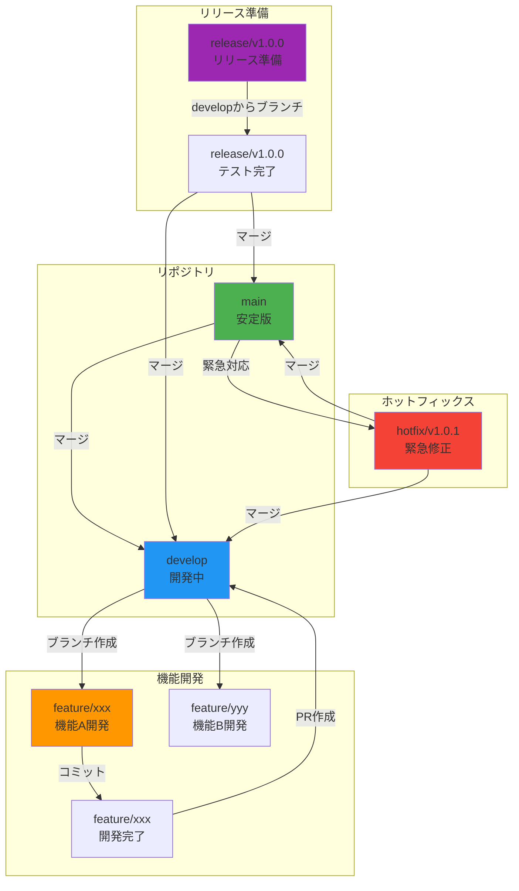

# 開発ガイド

## TL;DR

TreeTopicでの開発はGitFlowモデルを採用しています。コーディング規約、PRレビュープロセス、テスト要件を遵守し、高品質なコードを維持します。主要なブランチ戦略はfeature/develop/release/mainの4段階です。

## 開発フロー

### 全体フロー図



### ブランチ戦略

#### mainブランチ
- **目的**: ステージング/本番環境用の安定版
- **マージ元**: releaseブランチ
- **保護**: PR必須、CI必須、署名必須
- **更新頻度**: リリース時

#### developブランチ
- **目的**: 機能開発のベースライン
- **マージ元**: featureブランチ
- **保護**: CI必須（テスト必須）
- **更新頻度**: 機能マージ時

#### featureブランチ
- **命名規則**: `feature/機能名-概要`
- **例**: `feature/user-auth-google`, `feature/room-export-pdf`
- **マージ先**: developブランチ
- **ライフサイクル**: 機能開発期間

#### releaseブランチ
- **命名規則**: `release/v{バージョン}`
- **例**: `release/v1.0.0`, `release/v1.1.0`
- **マージ先**: mainとdevelop
- **目的**: リリース前の最終調整とテスト

#### hotfixブランチ
- **命名規則**: `hotfix/v{バージョン}-修正内容`
- **例**: `hotfix/v1.0.1-security-patch`
- **マージ先**: mainとdevelop
- **目的**: 本番環境の緊急修正

## コーディング規約

### C#コーディング規約

#### 命名規則
| 種類 | ルール | 例 |
|------|-------|-----|
| クラス | PascalCase | `RoomManagementService` |
| メソッド | PascalCase | `CreateRoomAsync` |
| プロパティ | PascalCase | `RoomName` |
| ローカル変数 | camelCase | `roomName` |
| パラメータ | camelCase | `request` |
| 定数 | PascalCase + UPPER_CASE | `MAX_ROOM_NAME_LENGTH` |

#### フォーマットルール
```csharp
// インデント: 4スペース
// 最大行長: 120文字
// usingはアルファベット順

using System;
using System.Collections.Generic;
using System.Threading.Tasks;
using TreeTopic.Models;
using TreeTopic.Services;

namespace TreeTopic.Services
{
    public class RoomManagementService : BaseService
    {
        private readonly IRoomRepository _roomRepository;
        private readonly IRoomPermissionRepository _permissionRepository;

        public RoomManagementService(
            IRoomRepository roomRepository,
            IRoomPermissionRepository permissionRepository)
        {
            _roomRepository = roomRepository;
            _permissionRepository = permissionRepository;
        }

        public async Task<Result<RoomDto>> CreateRoomAsync(
            CreateRoomRequest request,
            Guid userId)
        {
            return await ExecuteAsync(async () =>
            {
                var room = new Room
                {
                    Name = request.Name,
                    Description = request.Description,
                    IsPublic = request.IsPublic,
                    CreatedBy = userId,
                    Created = DateTime.UtcNow
                };

                await _roomRepository.AddAsync(room);
                await _permissionRepository.AddAsync(new RoomPermission
                {
                    RoomId = room.Id,
                    UserId = userId,
                    Role = Role.Owner,
                    Added = DateTime.UtcNow
                });

                return MapToDto(room);
            });
        }
    }
}
```

#### XMLドキュメントコメント
```csharp
/// <summary>
/// ルームを作成します
/// </summary>
/// <param name="request">ルーム作成リクエスト</param>
/// <param name="userId">作成者ID</param>
/// <returns>作成結果</returns>
/// <exception cref="ValidationException">リクエストの検証に失敗した場合</exception>
/// <exception cref="UnauthorizedException">認証されていない場合</exception>
public async Task<Result<RoomDto>> CreateRoomAsync(
    CreateRoomRequest request,
    Guid userId)
{
    // 実装
}
```

### TypeScript/Svelteコーディング規約

#### ファイル命名
- **コンポーネント**: PascalCase.svelte (例: `RoomCard.svelte`)
- **ストア**: camelCase.ts (例: `roomStore.ts`)
- **サービス**: camelCase.service.ts (例: `api.service.ts`)
- **タイプ**: camelCase.types.ts (例: `room.types.ts`)

#### コンポーネントの構造
```svelte
<script lang="ts">
    import { onMount } from 'svelte';
    import { roomStore } from '$lib/stores/roomStore';
    import { RoomCard } from '$lib/components/RoomCard.svelte';

    export let roomId: string;

    $: room = $roomStore.rooms?.find(r => r.id === roomId);

    onMount(async () => {
        await roomStore.loadRoom(roomId);
    });
</script>

<div class="room-detail">
    <h1>{$room?.name}</h1>
    <p>{$room?.description}</p>

    <RoomCard {room} />

    <!-- コメントの記述方法 -->
    {#if $room?.isPublic}
        <Badge variant="success">公開ルーム</Badge>
    {:else}
        <Badge variant="secondary">非公開ルーム</Badge>
    {/if}
</div>

<style>
    .room-detail {
        padding: 1rem;
    }
</style>
```

#### ストアの実装例
```typescript
// $lib/stores/roomStore.ts
import { writable, derived } from 'svelte/store';
import type { Room, RoomDto } from '$lib/types/room.types';
import { apiService } from '$lib/services/api.service';

function createRoomStore() {
    const rooms = writable<Room[]>([]);
    const loading = writable(false);
    const error = writable<string | null>(null);

    async function loadRooms() {
        loading.set(true);
        error.set(null);

        try {
            const response = await apiService.get<RoomDto[]>('/rooms');
            rooms.set(response.data);
        } catch (err) {
            error.set(err instanceof Error ? err.message : 'Failed to load rooms');
        } finally {
            loading.set(false);
        }
    }

    async function createRoom(roomData: Partial<Room>) {
        loading.set(true);

        try {
            const response = await apiService.post<RoomDto>('/rooms', roomData);
            rooms.update(rooms => [...rooms, response.data]);
            return response.data;
        } catch (err) {
            error.set(err instanceof Error ? err.message : 'Failed to create room');
            throw err;
        } finally {
            loading.set(false);
        }
    }

    return {
        rooms: derived(rooms, $rooms => $rooms),
        loading: derived(loading, $loading => $loading),
        error: derived(error, $error => $error),
        loadRooms,
        createRoom
    };
}

export const roomStore = createRoomStore();
```

## コードレビュープロセス

### PR作成のチェックリスト

#### 必須項目
- [ ] コードが機能要件を満たしている
- [ ] テストが実装されている（新規機能の場合）
- [ ] テストがパスしている
- [ ] CIパイプラインが通過している
- [ ] コーディング規約を遵守している
- [ ] README/ドキュメントを更新した場合

#### 品質項目
- [ ] コードが読みやすい（適切な変数名、コメント）
- [ ] 重複コードがなく、DRY原則に従っている
- [ ] エラーハンドリングが適切
- [ ] パフォーマンスに問題がない
- [ ] セキュリティ上の問題がない
- [ ] 既存のテストに影響がない

### PRテンプレート

```markdown
## 変更内容
（変更した機能の概要を簡潔に記述）

## 理由
（なぜこの変更が必要か、背景を記述）

## 実装詳細
（技術的な実装方法や重要な設計判断）

## テスト
- [ ] 単体テストを実装
- [ ] 統合テストを実装
- [ ] E2Eテストを実装
- [ ] テストケースの説明

## 破壊的変更
（APIの変更など、既存コードに影響がある場合）

## その他
（スクリーンショット、関連issueなど）

## レビューガイドライン
- ビジネスロジックの確認
- エラーハンドリングの確認
- パフォーマンス影響の確認
- テストカバレッジの確認
```

### レビューアーのチェックポイント

#### コード品質
- 関心事の分離が適切か
- 単一責任の原則を守っているか
- 依存関係が適切か（循環参照がないか）

#### セキュリティ
- 入力値の検証がされているか
- SQLインジェクション対策
- XSS対策
- 権限チェックが実装されているか

#### パフォーマンス
- N+1クエリの問題がないか
- 不必要なデータ取得がないか
- 非同期処理が適切か
- キャッシュの使用が適切か

## リリースプロセス

### セマンティックバージョニング

#### バージョン番号の形式
```
MAJOR.MINOR.PATCH
例: 1.0.0
```

#### バージョニングルール
- **MAJOR**: 破壊的変更を含む場合（1.0.0 → 2.0.0）
- **MINOR**: 新機能を追加する場合（1.0.0 → 1.1.0）
- **PATCH**: バグ修正のみの場合（1.0.0 → 1.0.1）

#### プリリリースバージョン
- **alpha**: 不安定な開発版
- **beta**: 機能は安定だけるバグあり
- **rc**: リリース候補

### リリース手順

#### 1. リリースブランチの作成
```bash
# developからリリースブランチを作成
git checkout develop
git checkout -b release/v1.0.0

# バージョン番号を更新
dotnet bumpversion patch --allow-dirty
```

#### 2. 最終テスト
```bash
# 全テストの実行
npm test
dotnet test

# E2Eテストの実行
npm run test:e2e

# セキュリティスキャン
npm audit --audit-level moderate
trivy image .
```

#### 3. リリースノートの作成
```markdown
## v1.0.0 (2024-01-19)

### 新機能
- ルーム作成機能
- メッセージ送信機能
- Google OAuth認証

### 改善
- UIのレスポンシブ対応
- パフォーマンス改善

### 修正
- ログイン画面の表示バグ
- メッセージ編集時の不具合
```

#### 4. リリース実行
```bash
# mainとdevelopへのマージ
git checkout main
git merge release/v1.0.0 --no-ff
git tag -a v1.0.0 -m "Release v1.0.0"
git push origin main --tags

git checkout develop
git merge release/v1.0.0 --no-ff
git push origin develop
```

## よくある変更レシピ

### 新しいAPIエンドポイントの追加

#### 1. モデルの定義
```csharp
// TreeTopic/Models/NewFeature.cs
public class NewFeature
{
    [Key]
    public Guid Id { get; set; }

    [Required]
    [StringLength(100)]
    public string Name { get; set; } = string.Empty;

    public string Description { get; set; } = string.Empty;

    [Required]
    public Guid CreatedBy { get; set; }

    public DateTime Created { get; set; } = DateTime.UtcNow;
}
```

#### 2. リポジトリインターフェースの定義
```csharp
// TreeTopic/Repositories/INewFeatureRepository.cs
public interface INewFeatureRepository
{
    Task AddAsync(NewFeature feature);
    Task<NewFeature?> GetByIdAsync(Guid id);
    Task<List<NewFeature>> GetByUserIdAsync(Guid userId);
}
```

#### 3. リポジトリ実装の追加
```csharp
// TreeTopic/Repositories/NewFeatureRepository.cs
public class NewFeatureRepository : INewFeatureRepository
{
    private readonly ApplicationDbContext _context;

    public NewFeatureRepository(ApplicationDbContext context)
    {
        _context = context;
    }

    public async Task AddAsync(NewFeature feature)
    {
        await _context.NewFeatures.AddAsync(feature);
        await _context.SaveChangesAsync();
    }

    public async Task<NewFeature?> GetByIdAsync(Guid id)
    {
        return await _context.NewFeatures.FindAsync(id);
    }

    public async Task<List<NewFeature>> GetByUserIdAsync(Guid userId)
    {
        return await _context.NewFeatures
            .Where(f => f.CreatedBy == userId)
            .OrderByDescending(f => f.Created)
            .ToListAsync();
    }
}
```

#### 4. サービスの実装
```csharp
// TreeTopic/Services/NewFeatureService.cs
public class NewFeatureService
{
    private readonly INewFeatureRepository _repository;
    private readonly ILogger<NewFeatureService> _logger;

    public NewFeatureService(
        INewFeatureRepository repository,
        ILogger<NewFeatureService> logger)
    {
        _repository = repository;
        _logger = logger;
    }

    public async Task<Result<NewFeatureDto>> CreateAsync(
        CreateNewFeatureRequest request,
        Guid userId)
    {
        return await ExecuteAsync(async () =>
        {
            var feature = new NewFeature
            {
                Name = request.Name,
                Description = request.Description,
                CreatedBy = userId,
                Created = DateTime.UtcNow
            };

            await _repository.AddAsync(feature);
            return MapToDto(feature);
        });
    }
}
```

#### 5. コントローラの追加
```csharp
// TreeTopic/Controllers/NewFeatureController.cs
[ApiController]
[Route("{tenant}/api/new-features")]
[Authorize]
public class NewFeatureController : ControllerBase
{
    private readonly NewFeatureService _service;

    public NewFeatureController(NewFeatureService service)
    {
        _service = service;
    }

    [HttpPost]
    public async Task<IActionResult> Create(
        [FromBody] CreateNewFeatureRequest request)
    {
        var result = await _service.CreateAsync(request, GetCurrentUserId());

        return result.Success
            ? CreatedAtAction(nameof(GetById), new { id = result.Data!.Id }, result.Data)
            : BadRequest(result.Error);
    }
}
```

### 新しいフロントエンドコンポーネントの追加

#### 1. 型定義の追加
```typescript
// src/lib/types/new-feature.types.ts
export interface NewFeature {
  id: string;
  name: string;
  description: string;
  createdBy: string;
  created: string;
}

export interface CreateNewFeatureRequest {
  name: string;
  description: string;
}
```

#### 2. ストアの実装
```typescript
// src/lib/stores/new-feature.store.ts
import { writable, derived } from 'svelte/store';
import type { NewFeature, CreateNewFeatureRequest } from '$lib/types/new-feature.types';
import { apiService } from '$lib/services/api.service';

export function createNewFeatureStore() {
    const features = writable<NewFeature[]>([]);
    const loading = writable(false);

    async function create(request: CreateNewFeatureRequest) {
        const response = await apiService.post<NewFeature>('/new-features', request);
        features.update(features => [...features, response.data]);
        return response.data;
    }

    return {
        features: derived(features, $features => $features),
        loading: derived(loading, $loading => $loading),
        create
    };
}

export const newFeatureStore = createNewFeatureStore();
```

#### 3. コンポーネントの実装
```svelte
<!-- src/lib/components/NewFeatureCard.svelte -->
<script lang="ts">
    import { onMount } from 'svelte';
    import type { NewFeature } from '$lib/types/new-feature.types';

    export let feature: NewFeature;

    $: formattedDate = new Date(feature.created).toLocaleDateString();
</script>

<div class="new-feature-card">
    <h3>{feature.name}</h3>
    <p>{feature.description}</p>
    <small class="text-muted">作成日: {formattedDate}</small>
</div>

<style>
    .new-feature-card {
        border: 1px solid #e0e0e0;
        border-radius: 4px;
        padding: 1rem;
        margin-bottom: 1rem;
    }
</style>
```

## ツールと拡張機能

### Visual Studio Code拡張機能

#### 必須拡張
- **C#** - C# IntelliSenseとデバッグ
- **Svelte for VS Code** - Svelte構文ハイライト
- **ESLint** - JavaScript/TypeScriptリンター
- **Prettier - Code formatter** - コードフォーマッター
- **GitLens** - Git拡張機能

#### 推奨拡張
- **DotNet Restore** - .NET依存関係管理
- **Thunder Client** - APIテストクライアント
- **Docker** - Docker管理
- **REST Client** - APIテスト

### IDE設定

#### VS Code設定 (settings.json)
```json
{
    "editor.formatOnSave": true,
    "editor.codeActionsOnSave": {
        "source.fixAll.eslint": true
    },
    "editor.defaultFormatter": "esbenp.prettier-vscode",
    "editor.tabSize": 4,
    "editor.insertSpaces": true,
    "files.associations": {
        "*.svelte": "svelte"
    },
    "[svelte]": {
        "editor.defaultFormatter": "svelte.svelte-for-vscode"
    },
    "csharp.enableRoslynAnalyzers": true,
    "omnisharp.enableRoslynAnalyzers": true,
    "omnisharp.useEditorFormattingSettings": true,
    "omnisharp.enableAsyncCompletion": true
}
```

#### ESLint設定 (.eslintrc.cjs)
```javascript
module.exports = {
    root: true,
    env: {
        browser: true,
        es2020: true
    },
    extends: [
        'eslint:recommended',
        '@sveltejs/kit/recommended',
        'prettier'
    ],
    overrides: [
        {
            files: ['**/*.svelte'],
            parser: 'svelte',
            parserOptions: {
                parser: '@typescript-eslint/parser'
            }
        }
    ],
    parserOptions: {
        ecmaVersion: 2020,
        sourceType: 'module'
    },
    plugins: ['svelte3'],
    rules: {
        'svelte/no-at-html-tags': 'warn',
        'svelte/shorthand-attribute-assignment': 'error',
        'svelte/sort-attributes': ['error', {
            order: ['class', 'id', ...]
        }]
    }
};
```

---

**コードへの導線**
- **コーディング規約**: `TreeTopic/CodeAnalysisRules.ruleset`
- **PRテンプレート**: `.github/pull_request_template.md`
- **ビルド設定**: `TreeTopic/TreeTopic.csproj`
- **テスト設定**: `TreeTopic.Tests/`
- **リリーススクリプト**: `scripts/release.sh`

**参照 (根拠)**
- `TreeTopic/.gitignore` - Git設定
- `TreeTopic/TreeTopic.csproj` - プロジェクト設定
- `TreeTopic/TreeTopic.Client/package.json` - npmスクリプト
- `TreeTopic/TreeTopic.Client/svelte.config.js` - SvelteKit設定
- `TreeTopic/Properties/launchSettings.json` - デバッグ設定