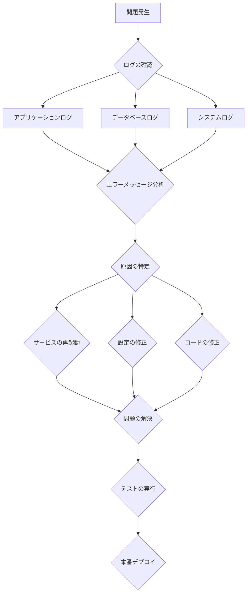

# 付録

## TL;DR

TreeTopicのFAQ、トラブルシュートガイド、既知の制約、改善提案をまとめました。ここで解決できない問題が発生した場合は、公式ドキュメントまたはコミュニティフォーラムをご確認ください。

## FAQ (よくある質問)

### 技術的な質問

**Q: なぜPostgreSQLを採用していますか？**
A: PostgreSQLはリレーショナルデータベースとして信頼性が高く、JSON型をネイティブサポートし、複雑なクエリにも対応できます。また、マルチテナント環境でのデータ分離にも適しています。

**Q: マルチテナアーキテクチャを採用している理由は？**
A: 各顧客（テナント）のデータを完全に分離することで、セキュリティを確保しつつ、カスタマイズ性を高められます。また、将来的にSaaSとして展開する際にも有利です。

**Q: SignalRを使ったリアルタイム通信のスケーラビリティは？**
A: 現状の実装ではインメモリ方式ですが、将来はRedisやAzure SignalR Serviceのような分散ソリューションに移行可能な設計になっています。

**Q: ファイルストレージはどこに保存されますか？**
A: デフォルトではローカルファイルシステムに保存されます。実装を変更することでS3やAzure Blob Storageなどのクラウドストレージにも対応できます。

### 運用に関する質問

**Q: 大量のメッセージが保存された場合のパフォーマンスは？**
A: メッセージはトピック単位で取得されるため、関連データのロードが効率的です。さらに古いメッセージは自動的にアーカイブされる設計になっています。

**Q: データバックアップはどのように行われますか？**
A: PostgreSQLのpg_dumpコマンドを使ったバックアップを推奨しています。ファイルストレージも定期的にバックアップしてください。

**Q: 既存のデータをTreeTopicに移行することは可能ですか？**
A: はい、データ移行用のAPIエンドポイントを提供しています。詳細は移行ガイドをご確認ください。

### カスタマイズに関する質問

**Q: UIテーマをカスタマイズすることはできますか？**
A: テナントごとにカスタムCSSとJavaScriptを設定できます。将来的にはSASS変数によるテーマシステムの強化を予定しています。

**Q: 認証プロバイダーを追加することはできますか？**
A: はい、OIDC対応の任意のプロバイダーを設定できます。カスタムプロバイダーの追加ガイドをご確認ください。

**Q: APIを独自に拡張することはできますか？**
A: ミドルウェアやサービスとして拡張可能です。ただし、バージョンアップ時の互換性を考慮してください。

## トラブルシュート

### 常見の問題と解決策

#### データベース接続エラー

**症状**
```
fail: TreeTopic.Program[0]
      An exception occurred while connecting to the database.
      Npgsql.PostgresException (0x80004005): 28000: connection to server at "localhost" (127.0.0.1), port 5432 failed: Connection refused
```

**原因**
- PostgreSQLサービスが停止している
- 接続文字列の設定が間違っている
- ファイアウォールがポートをブロックしている

**解決策**
```bash
# PostgreSQLサービスの確認
sudo systemctl status postgresql
sudo systemctl start postgresql

# 接続文字列の確認
psql -h localhost -U treetopic -d treetopic

# ファイアウォール設定の確認
sudo ufw status
sudo ufw allow 5432
```

#### 認証エラー

**症状**
```
fail: TreeTopic.Controllers.AuthController[0]
      OIDC authentication failed: invalid_client
```

**原因**
- Google OAuthクライアントID/シークレットの設定が間違っている
- リダイクトURIが正しく設定されていない
- ドメインが許可されていない

**解決策**
```bash
# 設定ファイルの確認
cat TreeTopic/appsettings.Development.json

# Google Cloud Consoleでの確認
1. https://console.cloud.google.com/apis/credentials にアクセス
2. OAuth 2.0 クライアントIDを確認
3. 承認済みのリダイクトURIに http://localhost:5265/signin-oidc を追加
```

#### ファイルアップロードエラー

**症状**
```
fail: Microsoft.AspNetCore.Mvc.Infrastructure.ObjectResultExecutor[1]
      Request body too large.
```

**原因**
- ファイルサイズが上限を超えている
- ディスク容量不足
- Webサーバーのアップロード制限

**解決策**
```json
// appsettings.json の更新
{
  "FileStorage": {
    "MaxFileSize": 104857600  // 100MBに増加
  }
}

# Nginx設定の更新 (使用時)
client_max_body_size 100M;
```

#### メッセージの表示遅延

**症状**
- メッセージが即座に表示されない
- UIの応答が遅い

**原因**
- データベースクエリの非効率さ
- ネットワーク遅延
- クライアントサイドのレンダリング問題

**解決策**
```sql
-- スロークエリの確認
SELECT query, calls, total_time, mean_time
FROM pg_stat_statements
ORDER BY total_time DESC
LIMIT 10;

-- インデックスの確認
SELECT * FROM pg_indexes WHERE tablename = 'messages';

-- 必要に応じてインデックスを作成
CREATE INDEX idx_messages_topic_id ON messages(topic_id);
CREATE INDEX idx_messages_created_by ON messages(created_by);
```

#### SignalR接続の不安定さ

**症状**
- WebSocket接続が頻繁に切断される
- メッセージの配送遅延

**原因**
- プロキシサーバーの設定
- クライアントサイドの再接続処理
- サーバーリソース不足

**解決策**
```typescript
// 再接続ロジックの強化
// src/lib/services/signalr.service.ts
export class SignalRService {
    private connection: HubConnection;
    private retryPolicy: { nextRetryDelayInMilliseconds: number };

    constructor() {
        this.connection = new HubConnectionBuilder()
            .withUrl('/messagehub', {
                skipNegotiation: true,
                transport: HttpTransportType.WebSockets
            })
            .withAutomaticReconnect({
                nextRetryDelayInMilliseconds: (retryContext) => {
                    if (retryContext.elapsedMilliseconds < 60000) {
                        return Math.min(retryContext.nextRetryInterval, 30000);
                    }
                    return null;
                }
            })
            .build();
    }
}
```

### トラブルシュートフロー

#### システムの状態確認



### デバッグツール

#### ログレベルの動的変更
```bash
# 運用中のログレベル変更
curl -X POST http://localhost:5265/health \
  -H "Content-Type: application/json" \
  -d '{"logging": {"level": "Debug"}}'
```

#### クエリの実行計画確認
```sql
-- 遅いクエリの実行計画
EXPLAIN ANALYZE
SELECT m.*, u.display_name
FROM messages m
JOIN users u ON m.created_by = u.id
WHERE m.topic_id = 'topic-uuid'
ORDER BY m.created DESC;
```

#### メモリプロファイリング
```bash
# .NETメモリダンプの取得
dotnet-dump collect -p <process-id>

# メモリ解析
dotnet-dump analyze <dump-file>
```

## 既知の制約

### 技術的制約

1. **データベース制約**
   - メッセージ本文の最大長: 5000文字
   - ファイルアップロードサイズ: 最大30MB
   - 同時トランザクション数: 最大100
   - インデックスの最大数: テーブルあたり32個

2. **ネットワーク制約**
   - WebSocketの同時接続数: 最大5,000
   - リクエストタイムアウト: 30秒
   - ファイルアップロードタイムアウト: 5分
   - CORS許可オリジン: 最大10ドメイン

3. **セキュリティ制約**
   - パスワードの最小長: 8文字
   - セッション有効期限: 30日
   - トークンのリフレッシュ間隔: 1時間
   - 暗号化キーのローテーション: 手動

### 機能的制約

1. **ユーザー管理**
   - 1テナントあたりの最大ユーザー数: 10,000
   - 同時ログインセッション: 最大3
   - パスワードリセットトークン有効期間: 24時間

2. **コンテンツ管理**
   - メッセージのバージョン履歴: 最新版のみ
   - ファイルのバージョン管理: 未対応
   - メッセージの検索範囲: 6ヶ月以内
   - エクスポート形式: JSONのみ

3. **パフォーマンス制約**
   - 検索結果の最大件数: 1,000件
   - 1ページあたりの表示件数: 最大50
   - リアルタイム更新の遅延: 最大2秒
   - バックグラウンドジョブの同時実行数: 最大10

### 将来的な制約の解除計画

| 制約項目 | 現在の制約 | 解除予定 | 詳細 |
|---------|-----------|----------|------|
| ファイルサイズ | 30MB | Q1 2024 | 100MBへ増加、クラウドストレージ対応 |
| メッセージ検索範囲 | 6ヶ月 | Q2 2024 | 無制限検索、全文検索対応 |
| ユーザー数制限 | 10,000 | Q3 2024 | 100,000へ増加、シャーディング対応 |
| メッセージ履歴 | 最新版のみ | Q4 2024 | バージョン管理の実装 |

## 改善提案

### 技術的改善

1. **パフォーマンス改善**
   - キャッシュ戦略の最適化
     - Redis分散キャッシュの導入
     - クエリ結果のキャッシュ
     - CDN対応 for 静的リソース

2. **スケーラビリティ向上**
   - データベースのシャーディング
     - テナントIDに基づく分割
     - リードレプリカの追加
     - データベース負荷分散

3. **監視・計測の強化**
   - 分散トレーシングの導入
     - Jaeger対応
     - 自動APMレポート
     - パフォーマンスダッシュボード

4. **セキュリティ強化**
   - 多要素認証のサポート
   - APIキー認証の実装
   - ログイン試行のレートリミット
   - データ暗号化の強化

### 機能的改善

1. **コラボレーション機能**
   - リアルタイム共同編集
   - コメント機能の追加
   - タスク管理との連携
   - メンション機能の実装

2. **コンテンツ管理**
   - メッセージのバージョン管理
   - ファイルのバージョン管理
   - メッセージのエクスポート機能（PDF, CSV）
   - コンテンツの全文検索

3. **カスタマイズ性**
   - テーマシステムの強化
   - プラグインシステムの導入
   - Webhookの拡張機能
   - カスタムフィールドのサポート

4. **運用機能**
   - セルフサービスポータル
   - 利用状況のレポート機能
   - データ移行ツール
   - バックアップ自動化

### UX改善

1. **ユーザーインターフェース**
   - ダークモードの完全対応
   - モバイル最適化の強化
   - アクセシビリティ改善（WCAG 2.1準拠）
   - マルチ言語対応（日本語、英語、中国語）

2. **パーソナライゼーション**
   - おすすめトピック機能
   - アクティビティフィード
   - カスタマイズ可能なダッシュボード
   - 通知設定の高度化

## 開発への貢献

### 貢献の方法

1. **Issueの報告**
   - GitHub Issuesでバグや機能要望を報告
   - 再現手順を明確に記述
   - 環境情報を提供

2. **プルリクエストの提出**
   - ブランチ戦略を遵守
   - テストを必ず実装
   - ドキュメントを更新

3. **ドキュメントの改善**
   - READMEの更新
   - APIドキュメントの追加
   - チュートリアルの作成

### コミュニティ参加

1. **Discordチャット**
   - https://discord.gg/treetopic
   - 開発者向けチャンネル
   - サポートチャンネル

2. **開発者ミーティング**
   - 毎週月曜日 20:00 JST
   - Zoomでのオンライン開催
   - アジェンダはGitHub Wikiで共有

3. **ブログ記事の投稿**
   - 技術的な記事の募集
   - ユースケースの共有
   - チュートリアルの執筆

### リリースサイクル

| バージョン | リリース予定 | 主な変更 |
|-----------|-------------|----------|
| v1.1.0 | 2024-02 | ファイルアップロードサイズ増加 |
| v1.2.0 | 2024-03 | メッセージ検索機能強化 |
| v1.3.0 | 2024-04 | モバイルUI改善 |
| v2.0.0 | 2024-06 | マルチテナント機能強化 |

---

**コードへの導線**
- **エラーハンドリング**: `TreeTopic/Common/Result.cs`
- **ログ設定**: `TreeTopic/Program.cs` (ロギング構成)
- **例外処理**: `TreeTopic/Services/BaseService.cs`
- **デバッグ用API**: `TreeTopic/Controllers/HealthController.cs`

**参照 (根拠)**
- `TreeTopic/README.md` - プロジェクト概要
- `TreeTopic/CHANGELOG.md` - 変更履歴
- `TreeTopic/appsettings.json` - 設定定義
- `TreeTopic/ExceptionFilters/` - 例外フィルター
- `TreeTopic/Middleware/` - ミドルウェア実装